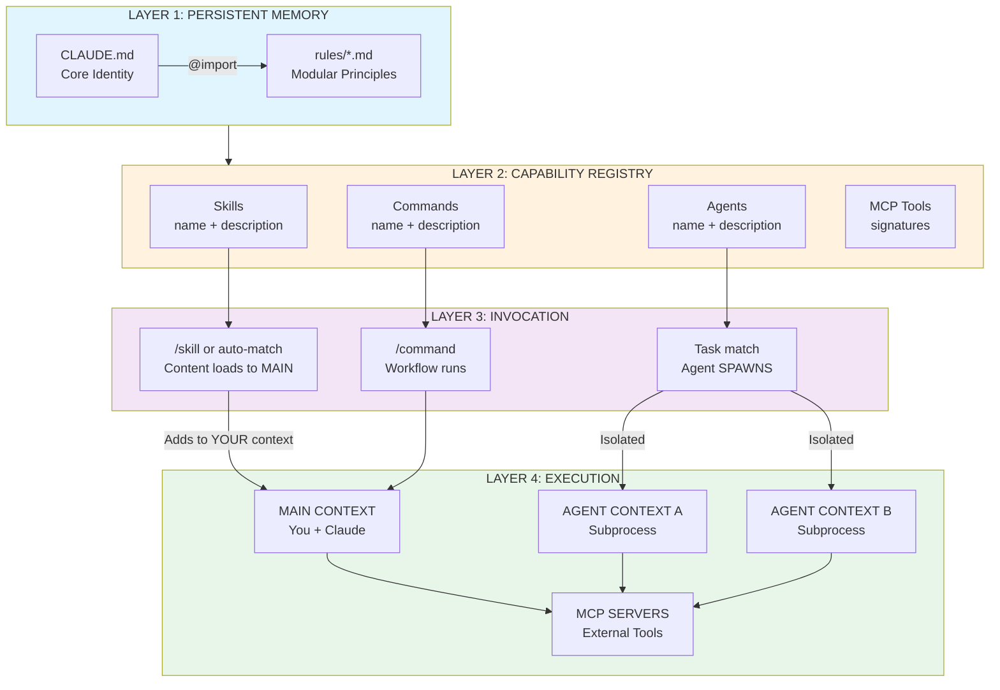
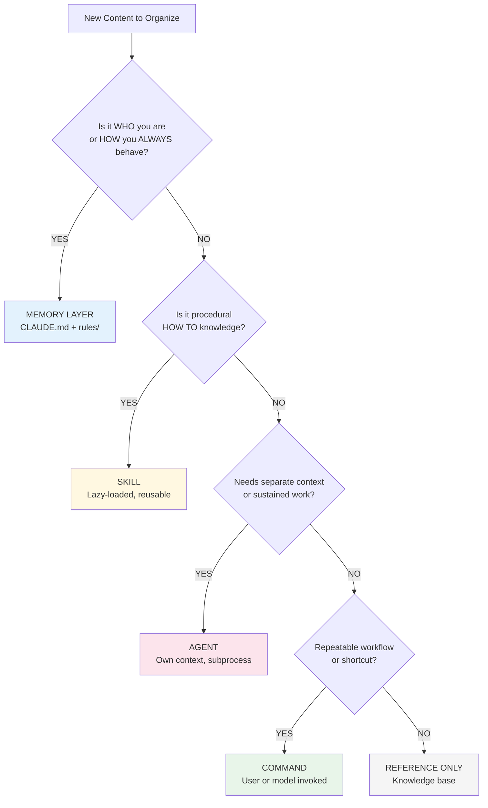
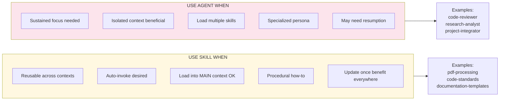
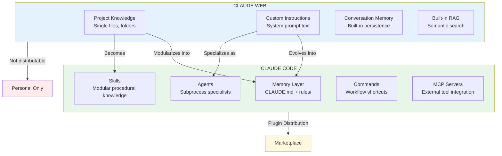
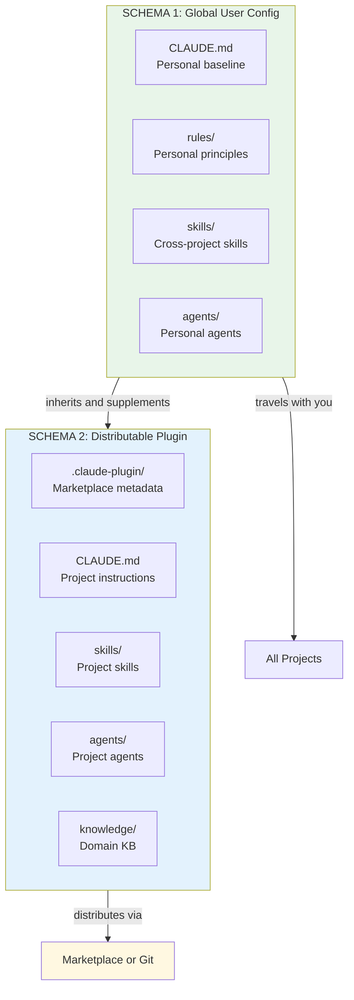
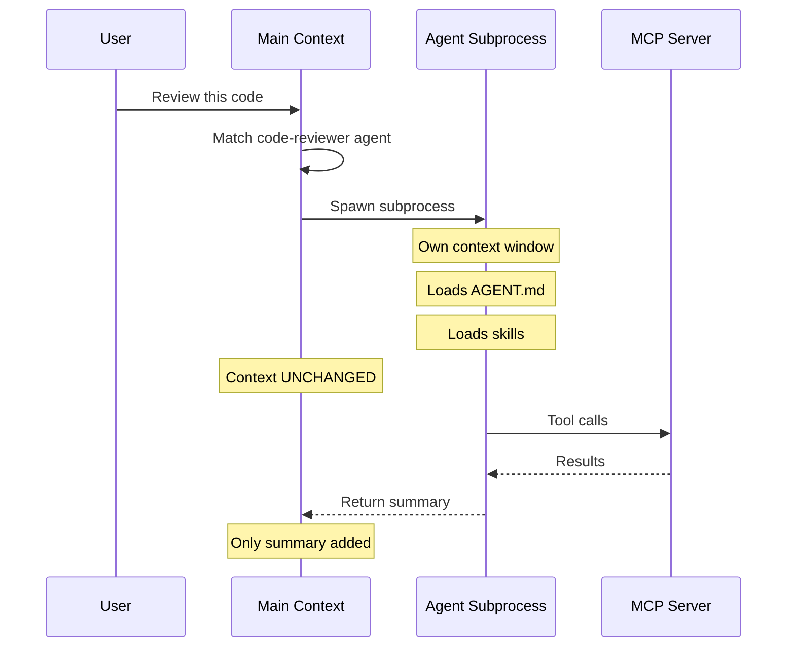
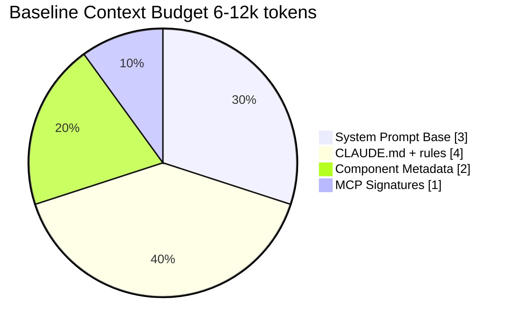

# Claude Code Architecture - Visual Diagrams

**Version**: 1.0 (2026-01-28)  
**Syntax**: Validated for Mermaid 10.x+

---

## Diagram 1: CC Runtime Layer Architecture

---

## Diagram 2: Content Placement Decision Tree

---

## Diagram 3: Skill vs Agent Decision

---

## Diagram 4: Claude Web vs Claude Code Platform Relationship

---

## Diagram 5: Custom LLM Evolution Stages

```mermaid
flowchart LR
    subgraph STAGE1["STAGE 1: Claude Web"]
        W1["Single instruction file"]
        W2["Project knowledge folder"]
        W3["Conversation history"]
    end
    
    subgraph STAGE2["STAGE 2: Modularization"]
        M1["Extract identity"]
        M2["Extract principles"]
        M3["Extract procedures"]
        M4["Extract personas"]
        M5["Extract workflows"]
    end
    
    subgraph STAGE3["STAGE 3: Claude Code"]
        C1["Memory Layer"]
        C2["Capability Registry"]
        C3["MCP Integration"]
    end
    
    subgraph STAGE4["STAGE 4: Distribution"]
        D1["Marketplace publish"]
        D2["Git repository"]
        D3["Team sharing"]
    end
    
    STAGE1 --> STAGE2
    STAGE2 --> STAGE3
    STAGE3 --> STAGE4
    
    style STAGE1 fill:#e3f2fd
    style STAGE2 fill:#fff8e1
    style STAGE3 fill:#e8f5e9
    style STAGE4 fill:#f3e5f5
```

---

## Diagram 6: Two-Schema Architecture

---

## Diagram 7: Agent Spawn Isolation

---

## Diagram 8: Token Budget Overview

---

## Usage Notes

**VS Code**: Install "Mermaid Preview" or "Markdown Preview Mermaid Support" extension

**GitHub**: Renders natively in markdown files

**Obsidian**: Enable Mermaid in settings

**Export**: Use mermaid.live for PNG/SVG export
