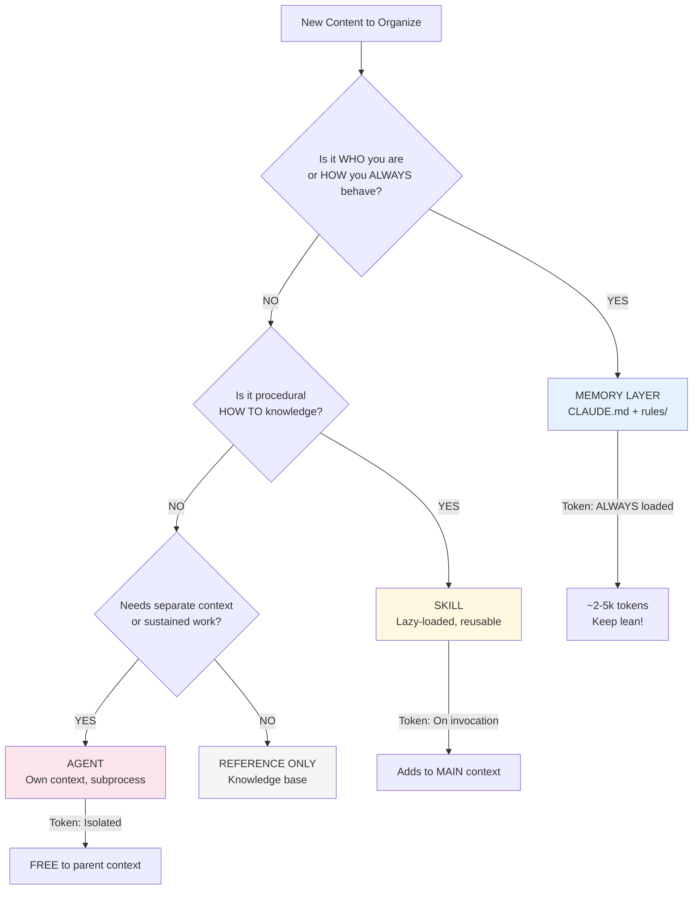
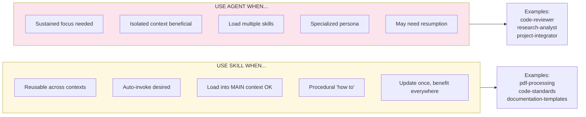
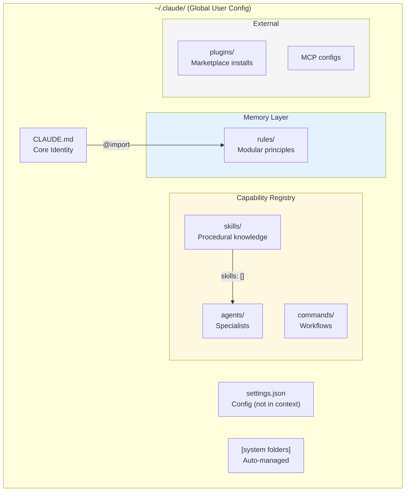
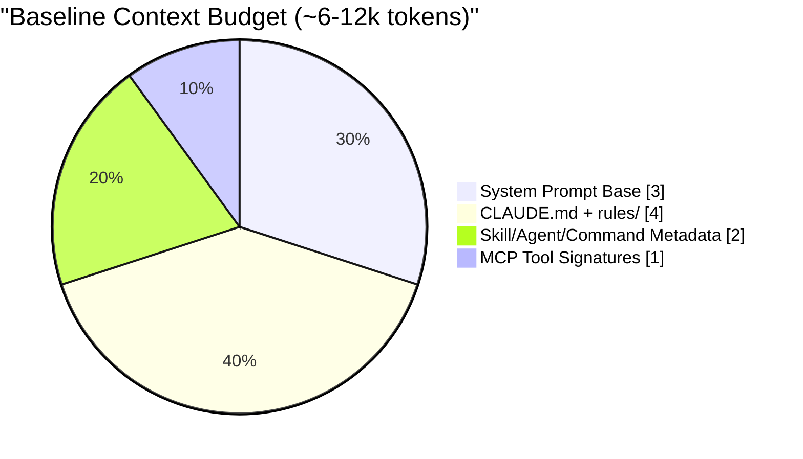
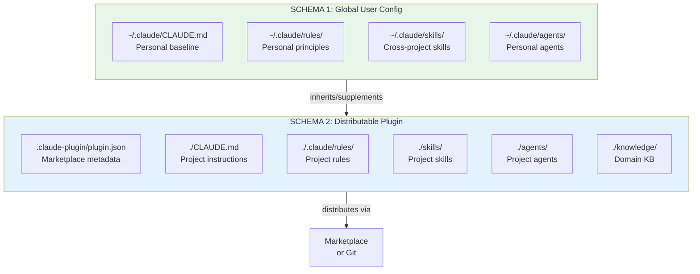
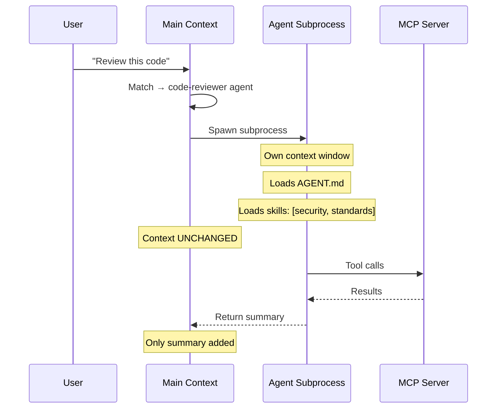

# Claude Code Architecture — Mermaid Diagrams

## Diagram 1: Runtime Layer Flow

```mermaid
flowchart TB
    subgraph L1["LAYER 1: PERSISTENT MEMORY (Always Loaded)"]
        CLAUDE[CLAUDE.md<br/>Core Identity]
        RULES[rules/*.md<br/>Modular Principles]
        CLAUDE -->|@import| RULES
    end

    subgraph L2["LAYER 2: CAPABILITY REGISTRY (Metadata Only)"]
        SKILLS_META[Skills<br/>name + description]
        AGENTS_META[Agents<br/>name + description]
        COMMANDS_META[Commands<br/>name + description]
        MCP_SIG[MCP Tools<br/>signatures]
    end

    subgraph L3["LAYER 3: INVOCATION (On-Demand)"]
        SKILL_INVOKE["/skill or auto-match<br/>→ Content loads to MAIN"]
        AGENT_SPAWN["Task match<br/>→ Agent SPAWNS"]
        CMD_EXEC["/command<br/>→ Workflow runs"]
    end

    subgraph L4["LAYER 4: EXECUTION (Runtime)"]
        MAIN[MAIN CONTEXT<br/>You + Claude]
        AGENT_A[AGENT CONTEXT A<br/>Subprocess]
        AGENT_B[AGENT CONTEXT B<br/>Subprocess]
        MCP_SERVER[MCP SERVERS<br/>External Tools]
    end

    L1 --> L2
    SKILLS_META --> SKILL_INVOKE
    AGENTS_META --> AGENT_SPAWN
    COMMANDS_META --> CMD_EXEC
    
    SKILL_INVOKE -->|"Adds to YOUR context"| MAIN
    AGENT_SPAWN -->|"Isolated (zero cost to parent)"| AGENT_A
    AGENT_SPAWN -->|"Isolated (zero cost to parent)"| AGENT_B
    CMD_EXEC --> MAIN
    
    MAIN --> MCP_SERVER
    AGENT_A --> MCP_SERVER
    AGENT_B --> MCP_SERVER

    style L1 fill:#e1f5fe
    style L2 fill:#fff3e0
    style L3 fill:#f3e5f5
    style L4 fill:#e8f5e9
```

## Diagram 2: Content Placement Decision Tree



## Diagram 3: Skill vs Agent Decision



## Diagram 4: Global Config Structure



## Diagram 5: Token Budget Overview



## Diagram 6: Two-Schema Architecture Overview



## Diagram 7: Agent Spawn Isolation



