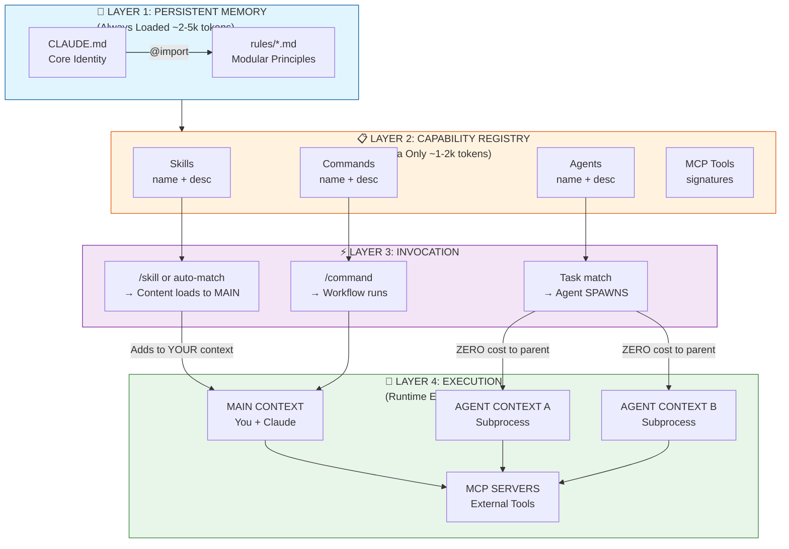
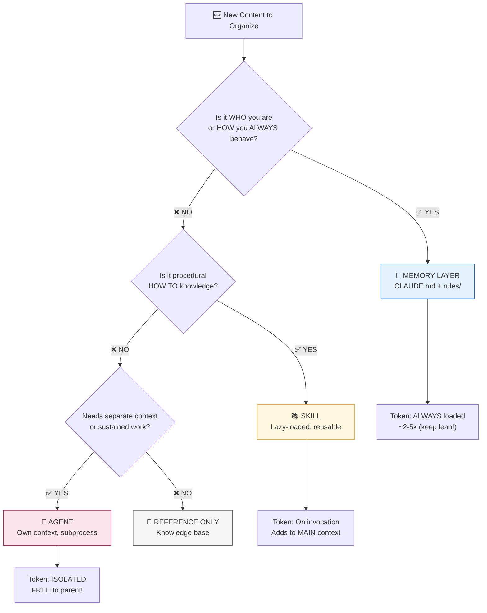
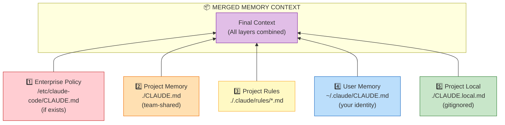
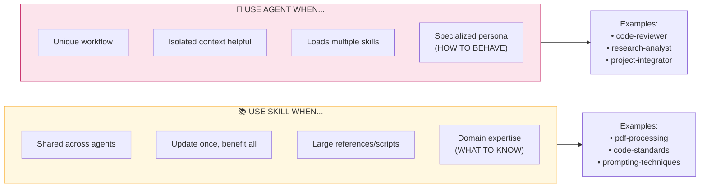
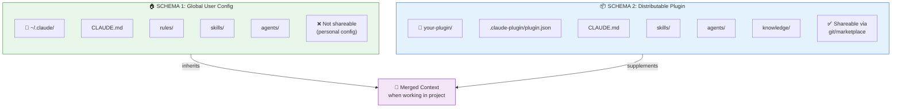
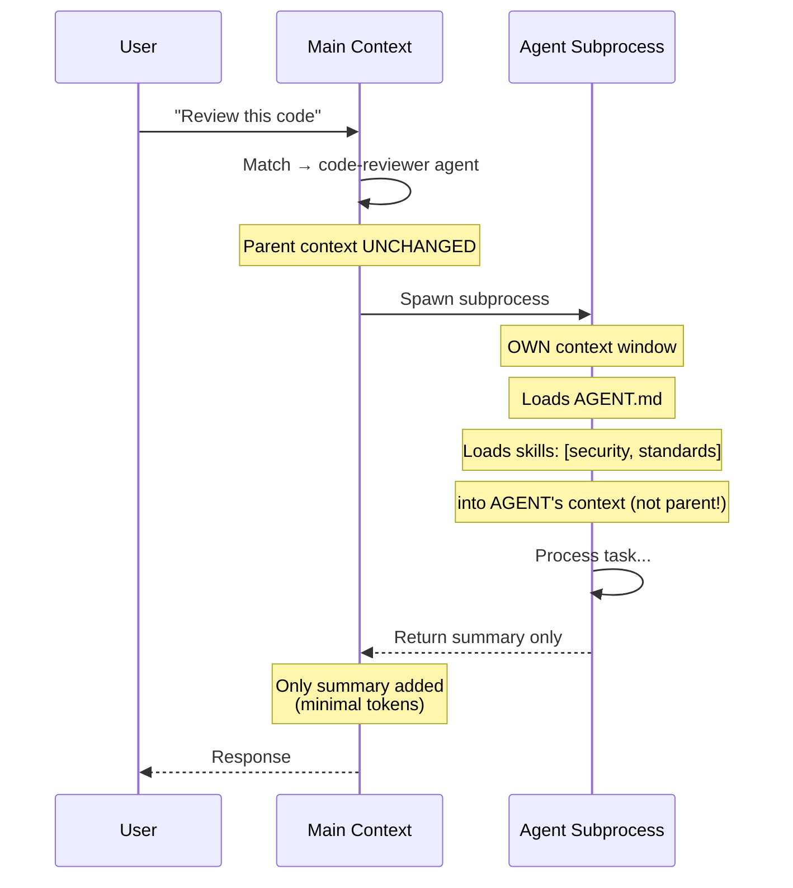
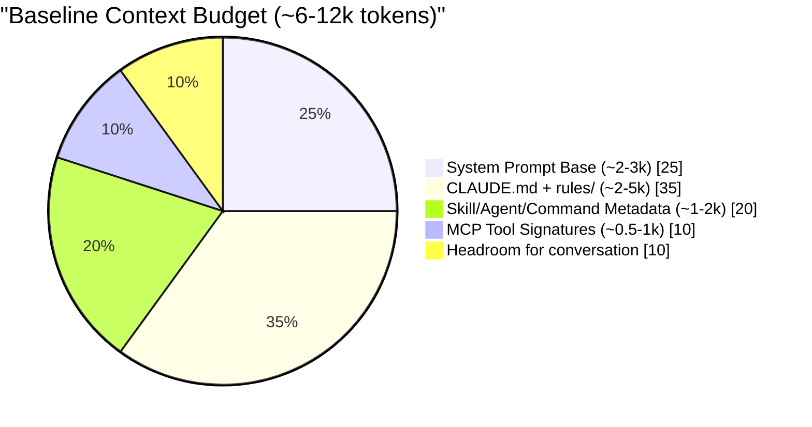
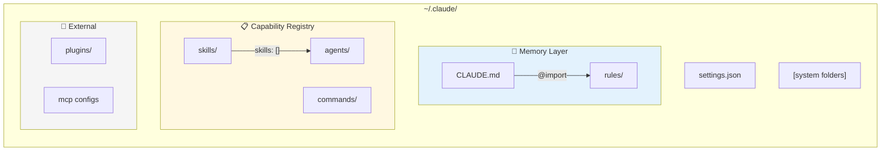

# Claude Code Architecture — Mermaid Diagrams v1.0

For rendering in tools that support Mermaid (GitHub, Notion, VS Code, etc.)

---

## Diagram 1: Runtime Layer Flow

---

## Diagram 2: Content Placement Decision Tree

---

## Diagram 3: Memory Precedence Hierarchy

---

## Diagram 4: Skill vs Agent Comparison

---

## Diagram 5: Two-Schema Architecture

---

## Diagram 6: Agent Spawn Sequence

---

## Diagram 7: Token Budget Breakdown

---

## Diagram 8: Global Config Directory Map

