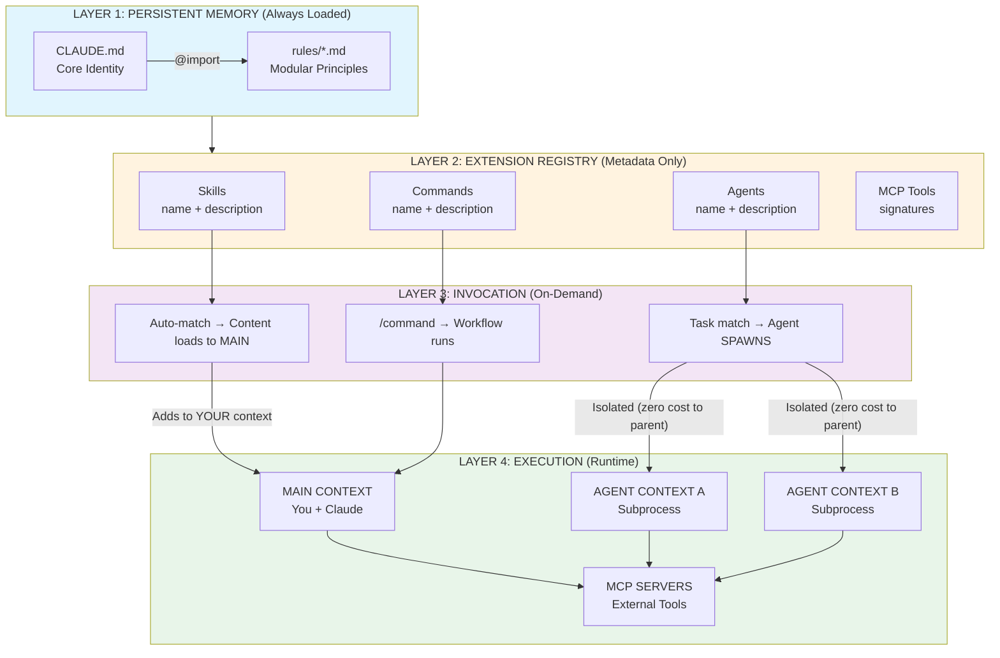
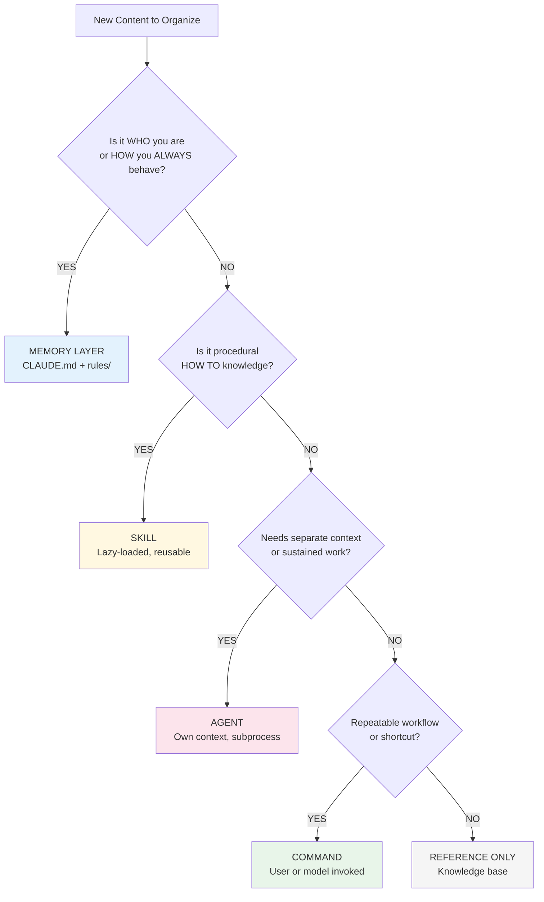
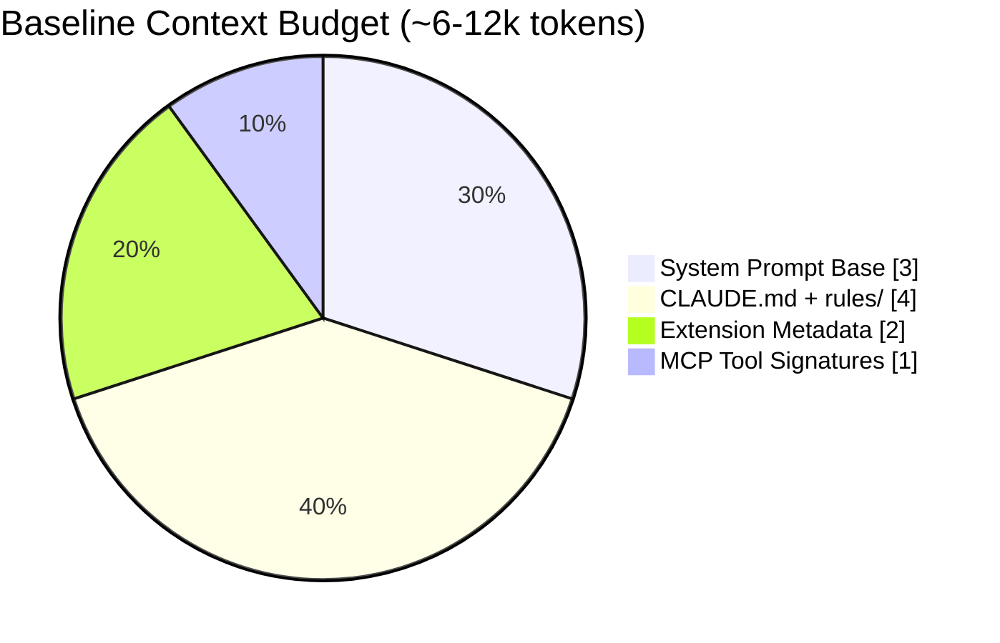
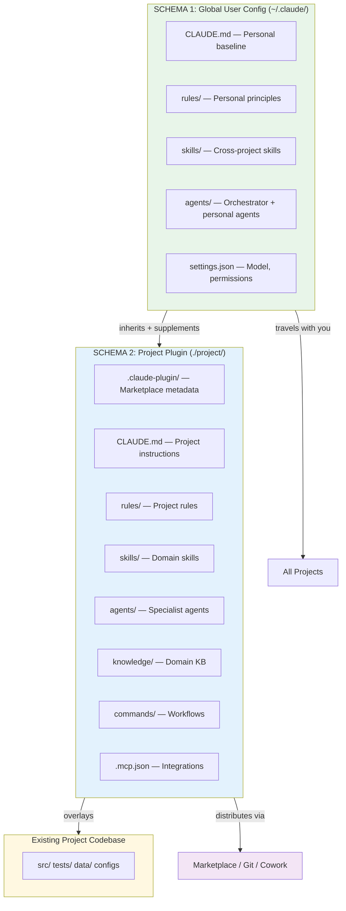
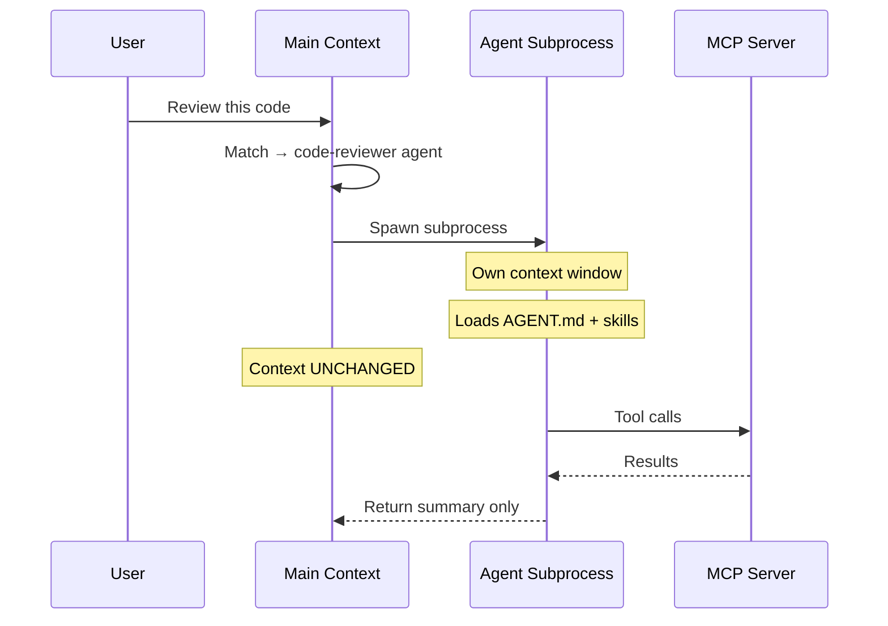
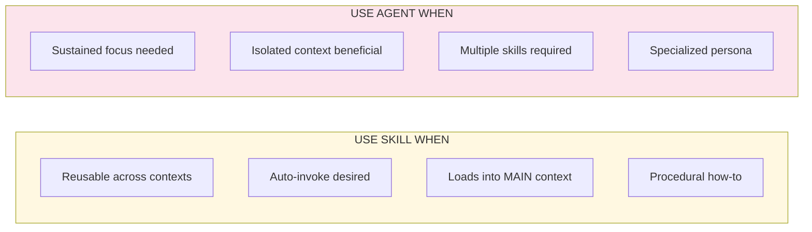

# CAB: Claude Code Architecture Guide

## A Standardized Framework for Custom LLM Development

<!-- DOCUMENT METADATA (Machine-Readable) -->

<!--
status: RELEASED
version: 1.0.0
author: Daneyon (with Claude)
last_updated: 2026-03-16
document_type: architecture_guide
primary_audience: [human]
sections_complete: [executive_summary, philosophy, prerequisites, schema_1, schema_2, extensions, distribution, agentic_patterns]
documentation_domain: code.claude.com
-->

> **CAB** (cc-architecture-builder): *Your taxi to stay in line to properly integrate CC with best practices — and you as the driver to apply project context engineering.*

**Version**: 1.0.0
**Author**: Daneyon (with Claude)
**Last Updated**: March 16, 2026

---

## Table of Contents

1. [Executive Summary](#1-executive-summary)k
2. [Architecture Philosophy](#2-architecture-philosophy)
3. [Prerequisites &amp; Git Foundation](#3-prerequisites--git-foundation)
4. [Schema 1: Global User Configuration](#4-schema-1-global-user-configuration)
5. [Schema 2: Distributable Plugin Project](#5-schema-2-distributable-plugin-project)
6. [Extension Deep Dives](#6-extension-deep-dives)
7. [Distribution, Marketplace &amp; Cowork](#7-distribution-marketplace--cowork)
8. [Agentic Workflow Patterns &amp; Operations](#8-agentic-workflow-patterns--operations)
9. [Roadmap](#10-roadmap)
10. [Appendix A: Glossary](#appendix-a-glossary)
11. [Appendix B: References](#appendix-b-references)
12. [Appendix C: Domain Integration Example — HEC-RAS 2D](#appendix-c-domain-integration-example--hec-ras-2d-automation-suite)

---

## 1. Executive Summary

### What is CAB?

**CAB (cc-architecture-builder)** is a standardized framework for building custom LLM solutions using Claude Code. If you're new to Claude and LLMs, start with the official overview: [Claude Code Overview](https://code.claude.com/docs/en/overview).

This guide focuses on what CAB adds beyond the official docs: a standardized architecture, naming conventions, orchestration patterns, and best practices for building, operating, and sharing custom LLM solutions. **Where the official docs explain something well, we link to them rather than duplicate.**

### Core Insight

Claude Code is not merely a coding assistant — it is a **configurable AI platform** with filesystem access, tool integration, and extensible capabilities. This architecture leverages Claude Code for any custom LLM use case: coding projects, research assistants, domain-specific knowledge bases, or enterprise automation.

### End-Product Vision: Autonomous Multi-Agent Framework

The ultimate objective of CAB is to establish a **multi-agent framework** where the custom LLM operates autonomously to the fullest extent possible — securely minimizing human-in-the-loop processes to periodic knowledge base updates and alignment with official CC platform upgrades. This is achieved through:

- A **main orchestrator agent** (global config) that synthesizes, delegates, and manages state
- **Domain-specialist agents** (project config) that execute scoped tasks based on role/type
- **Orchestration patterns** that automate task execution, verification, and state management
- **Plugin extensions** (skills, commands, hooks) that encode repeatable workflows

### Key Design Principles

| Principle                               | Description                                                                                      |
| --------------------------------------- | ------------------------------------------------------------------------------------------------ |
| **Separation of Concerns**        | Global config stays personal; project config is distributable                                    |
| **Progressive Disclosure**        | Load only what's needed; reference additional files via `@imports`                             |
| **Convention over Configuration** | Follow official directory structures; minimize custom conventions                                |
| **Git-Native Workflow**           | Version control everything; enable team collaboration                                            |
| **Token Efficiency**              | Context window is a shared, finite resource — every token of config displaces productive output |
| **Security by Default**           | Private repos, credential exclusion, pre-publication review                                      |
| **Verification as Requirement**   | Every agent, task, and phase gate requires a verification method                                 |
| **Multi-Agent Autonomy**          | Design for autonomous operation; minimize human-in-the-loop to oversight and KB maintenance      |

---

## 2. Architecture Philosophy

### The Base Architecture Schema

Both global user config and project plugin config share the **same base architecture schema** — they differ only in scope (personal vs. distributable) and location. The schema consists of:

```
[Base Architecture Schema — applies at both global and project level]

Memory Layer:     CLAUDE.md + rules/        (always loaded)
Extension Pack:   skills/ + agents/ + commands/ + hooks/   (on-demand)
Integration:      .mcp.json + settings.json (configuration)
Knowledge:        knowledge/ or shared-knowledge/  (reference material)
```

**Schema 1 (Global)** = base schema at `~/.claude/`, private, travels with you, applies to ALL projects.
**Schema 2 (Plugin)** = base schema at `./project/`, distributable, team-shared, domain-specific.

The global config acts as the **main orchestrator + synthesizer + state manager**. Project configs act as **domain-specialist agents** — delegated to based on specific role/task type.

### CC Runtime Layer Architecture

The following diagram shows how Claude Code loads and invokes the architecture at runtime:



### The Memory Hierarchy (5 Tiers)

> **Official docs**: [Manage Claude&#39;s memory](https://code.claude.com/docs/en/memory)

| Tier                           | Location                 | Purpose                             | Shared With   |
| ------------------------------ | ------------------------ | ----------------------------------- | ------------- |
| **1. Enterprise Policy** | System paths*            | Organization-wide standards         | All org users |
| **2. Project Memory**    | `./CLAUDE.md`          | Team-shared instructions            | Team via git  |
| **3. Project Rules**     | `./.claude/rules/*.md` | Modular topic-specific rules        | Team via git  |
| **4. User Memory**       | `~/.claude/CLAUDE.md`  | Personal preferences (all projects) | Just you      |
| **5. Project Local**     | `./CLAUDE.local.md`    | Personal project-specific           | Just you      |

*Enterprise paths: macOS `/Library/Application Support/ClaudeCode/CLAUDE.md`, Linux `/etc/claude-code/CLAUDE.md`, Windows `C:\Program Files\ClaudeCode\CLAUDE.md`

**Precedence Rule**: Files higher in the hierarchy load first and take precedence. `CLAUDE.local.md` is auto-added to `.gitignore`.

### Invocation Patterns

| Extension                    | Invocation            | Trigger                              |
| ---------------------------- | --------------------- | ------------------------------------ |
| **Memory (CLAUDE.md)** | Automatic             | Always loaded at session start       |
| **Project Rules**      | Automatic             | Loaded at session start              |
| **Skills**             | Model-invoked         | Claude decides based on task context |
| **Subagents**          | Model or user-invoked | Auto-delegated or explicitly called  |
| **Commands**           | User-invoked          | Explicitly typed (e.g.,`/analyze`) |
| **Hooks**              | Event-driven          | Triggered by system events           |

### Content Placement Decision Tree



### Token Budget Awareness



Every token of configuration displaces productive conversation. Keep CLAUDE.md lean; use extensions for specialized knowledge.

---

## 3. Prerequisites & Git Foundation

> **Official docs**: [Quickstart](https://code.claude.com/docs/en/quickstart)

### Why Git is Foundational

Git is **architecturally required** for this framework — plugin distribution, team collaboration, version control, and parallel execution (worktrees) all depend on it.

### Streamlined Setup: `/init-plugin` Command (CAB Proposed)

Rather than manual setup, CAB proposes an `/init-plugin` command that automates the full foundational workflow:

```bash
# What /init-plugin automates:
/init-plugin my-custom-llm "Domain-specific assistant for [purpose]"

# Equivalent manual steps:
mkdir -p my-custom-llm/{.claude-plugin,.claude/{rules,skills},commands,agents,knowledge,hooks}
cd my-custom-llm
touch .claude-plugin/plugin.json CLAUDE.md README.md .gitignore .mcp.json hooks/hooks.json knowledge/INDEX.md
git init
git add . && git commit -m "Initial plugin structure via CAB"
gh repo create my-custom-llm --private --source=. --push  # optional
```

### Streamlined Worktree Setup: `/init-worktree` Command (CAB Proposed)

For parallel agent execution, CAB proposes `/init-worktree`:

```bash
# What /init-worktree automates:
/init-worktree feature-auth feature-api

# Creates:
#   .claude/worktrees/feature-auth (from origin/main)
#   .claude/worktrees/feature-api  (from origin/main)
# Generates shell aliases: za, zb for fast switching
```

### Privacy & Security Defaults

**Always create repositories as private by default.** Files that should NEVER be committed: `.env`, `*.key`, `*.pem`, `settings.local.json`, `CLAUDE.local.md`, `credentials.json`.

---

## 4. Schema 1: Global User Configuration

### Purpose

Your global config at `~/.claude/` is your **personal baseline** — it applies to ALL projects and acts as the **main orchestrator layer**: synthesizing context, delegating to domain-specialist agents (project configs), and managing cross-project state.

### Directory Structure (Full Base Architecture)

```
~/.claude/
├── CLAUDE.md                     # Personal system instructions (always loaded)
├── settings.json                 # Model, permissions, agent defaults
│
├── rules/                        # Modular behavioral rules (always loaded)
│   ├── preferences.md            # Communication, formatting style
│   └── workflows.md              # Cross-project workflow standards
│
├── skills/                       # Personal skills (available in all projects)
│   ├── research-methodology/
│   │   └── SKILL.md
│   └── technical-writing/
│       └── SKILL.md
│
├── agents/                       # Personal agents
│   ├── orchestrator.md           # Main orchestrator (optional default agent)
│   └── general-researcher.md
│
└── shared-knowledge/             # Cross-project reference materials
    └── frameworks/
```

### CLAUDE.md Template (Hybrid: Custom LLM Framework + CC)

This template synthesizes the [Custom LLM Macro Architecture](custom_llm_macro_system_architecture.md) framework with CC-native primitives. The same structural pattern applies to both global and project CLAUDE.md — differentiated by scope, not shape.

```markdown
# [Identity Name]

## Role & Persona
[Clear role definition. One sentence primary persona, expertise domain, operating mode.]
[For global: "You are a senior engineering advisor and orchestrator..."]
[For project: "You are a [domain] specialist working on [project purpose]..."]

## Domain Guidelines
[Domain-specific standards, conventions, and quality criteria.]
[For global: cross-project standards]
[For project: domain-specific standards, coding conventions, testing requirements]

## Behavioral Constraints
[What NOT to do. Ethical boundaries, scope limits, fail-safe rules.]
- Do not modify files outside designated directories without approval
- Do not commit directly to main branch
- Always verify before marking tasks complete
- [Domain-specific constraints]

## Guardrails
[Input/output quality controls mapped to CC primitives.]
- Validation: PreToolUse hooks for dangerous operations
- Verification: Run test suite before any commit (see Verification section)
- Escalation: Flag uncertainty rather than guess

## Workflows
[Key operational workflows. For global: cross-project. For project: domain-specific.]
1. [Primary workflow — e.g., "Feature: plan → implement → test → verify → commit"]
2. [Secondary workflow]
3. [Maintenance workflow]

## Verification
[Concrete, runnable commands that confirm work is correct.]
```bash
npm run typecheck    # Type checking
npm run lint         # Linting
npm run test         # Full test suite
npm run build        # Build verification
```

## State Management

[How context persists across sessions.]

- Learned Corrections: [grows over time — "Update CLAUDE.md so you don't repeat this"]
- Session State: @./notes/ for cross-session persistence
- Progress Tracking: progress.md for multi-session tasks

## Extension Registry

[Pointers to available extensions — NOT the content itself.]

- Skills: see skills/ directory
- Agents: see agents/ directory
- Commands: see commands/ directory (if project-level)
- MCP: see .mcp.json (if configured)

## Knowledge Base

@knowledge/INDEX.md

## Personal Customization (Optional — project CLAUDE.md only)

@~/.claude/project-preferences.md

```

### settings.json (Global)

> **Official docs**: [Settings](https://code.claude.com/docs/en/settings)

```json
{
  "model": "sonnet",
  "agent": "orchestrator",
  "permissions": {
    "allow": ["Read", "Write", "Edit", "Bash(git *)"],
    "deny": []
  }
}
```

Setting `"agent": "orchestrator"` makes your orchestrator agent the default for all conversations — the foundation for multi-agent autonomous operation.

---

## 5. Schema 2: Distributable Plugin Project

### Purpose

A plugin project applies the **same base architecture schema** as global config, but scoped to a specific domain and distributable via marketplace or git. It lives **alongside your project's existing codebase**.

### CC Architecture Alongside Project Codebase

This is how CC extensions coexist with a real project:

```
my-project/                           # ← Your existing project root
│
│── src/                              # ← YOUR PROJECT CODE
│   ├── main.py                       #    (untouched by CC architecture)
│   ├── models/
│   └── utils/
│── tests/
│── data/
│── requirements.txt
│── Dockerfile
│
│── .claude-plugin/                   # ── CC ARCHITECTURE LAYER ──
│   └── plugin.json                   #    Marketplace metadata
│
│── CLAUDE.md                         #    Project memory (always loaded)
│── CLAUDE.local.md                   #    Personal overrides (gitignored)
│
│── .claude/                          #    CC configuration
│   ├── settings.json                 #    Project permissions, hooks
│   ├── rules/                        #    Modular project rules
│   │   ├── code-style.md
│   │   └── testing.md
│   └── skills/                       #    Project-scoped skills
│       └── domain-analysis/
│           └── SKILL.md
│
│── agents/                           #    Project subagents
│   ├── domain-expert.md
│   └── verifier.md
│
│── commands/                         #    Project slash commands
│   ├── analyze.md
│   └── report.md
│
│── hooks/
│   └── hooks.json                    #    Event-driven automation
│
│── knowledge/                        #    Domain knowledge base
│   ├── INDEX.md
│   ├── overview/
│   ├── standards/
│   └── reference/
│
│── .mcp.json                         #    MCP server connections
│── .gitignore
└── README.md
```

**Key principle**: The CC architecture is an **overlay** — it adds intelligence and automation without restructuring your existing project. Your source code, tests, data, and build files remain exactly where they are.

### Two-Schema Relationship



### plugin.json

```json
{
  "name": "my-custom-llm",
  "version": "1.0.0",
  "description": "Domain-specific custom LLM for [purpose]",
  "author": { "name": "Your Name" },
  "repository": "https://github.com/yourusername/my-custom-llm",
  "keywords": ["domain", "custom-llm"],
  "license": "MIT"
}
```

### CLAUDE.md (Project)

Uses the same template structure as [Section 4](#claudemd-template-hybrid-custom-llm-framework--cc), scoped to the project domain. The `## Personal Customization` section with `@~/.claude/project-preferences.md` import enables optional personalization without bloating the distributed plugin.

### settings.json (Project)

Shared with team via git. Pre-approves safe commands:

```json
{
  "permissions": {
    "allow": [
      "Bash(npm run test:*)", "Bash(npm run lint:*)",
      "Bash(git status)", "Bash(git diff)", "Bash(git log)"
    ]
  },
  "hooks": {
    "PostToolUse": [{
      "matcher": "Write|Edit",
      "hooks": [{ "type": "command", "command": "npm run format -- --write $CLAUDE_FILE_PATH 2>/dev/null || true" }]
    }]
  }
}
```

---

## 6. Extension Deep Dives

Each subsection summarizes the extension, highlights **CAB-specific conventions**, and links official docs for full reference.

### 6.1 Memory System (CLAUDE.md)

> **Official docs**: [Memory](https://code.claude.com/docs/en/memory)

The 5-tier memory hierarchy is defined in [Section 2](#the-memory-hierarchy-5-tiers). The CLAUDE.md template is defined in [Section 4](#claudemd-template-hybrid-custom-llm-framework--cc).

**Import Syntax**: `@path/to/file` includes external content. Supports relative and absolute paths, recursive chaining (max 5 hops). Use `/memory` to see all loaded files. Imports inside code blocks are ignored.

**Path-specific rules** in `.claude/rules/` use YAML frontmatter to scope:

```yaml
---
paths: src/api/**/*.ts
---
# API Development Rules
- All API endpoints must include input validation
```

**CAB Best Practices**: Be specific not vague. Use `.claude/rules/` for modular organization. Keep CLAUDE.md under 500 lines. Use `@imports` for detailed material. Add a "Learned Corrections" section that compounds knowledge over time.

### 6.2 Agent Skills

> **Official docs**: [Skills](https://code.claude.com/docs/en/skills) — covers structure, frontmatter, locations, progressive disclosure

Skills are **model-invoked** — Claude autonomously decides when to use them based on the `description` field.

**CAB Conventions**: Gerund naming (`analyzing-data`), description includes "Use when..." trigger conditions, max 64 chars name / 1024 chars description (CC runtime limits), progressive disclosure (metadata ~100 tokens → instructions <5k → resources on-demand).

### 6.3 Subagents

> **Official docs**: [Subagents](https://code.claude.com/docs/en/sub-agents) — covers file format, built-in agents, CLI config, resumable agents

Subagents operate in their **own context window** — isolating work without polluting the main conversation.

**Agent Spawn Isolation**:



**CAB-Specific Additions**:

| Field                           | CAB Addition                                                   |
| ------------------------------- | -------------------------------------------------------------- |
| **Verification section**  | **Required in every agent** — concrete, runnable checks |
| **Output Format section** | Structured report template for consistent handoff              |
| `permissionMode: plan`        | Recommended for advisory agents                                |
| `skills: [...]`               | Auto-load skills into agent context                            |

**Skill vs Agent Decision**:



### 6.4 Custom Commands

> **Official docs**: [CLI Reference](https://code.claude.com/docs/en/cli-reference)

Commands are **user-invoked** shortcuts triggered by `/command-name`. Place in `commands/` directory. **CAB Convention**: Name as `verb-object` (e.g., `/add-agent`, `/validate`, `/init-plugin`).

**CAB Daily Utility Commands** (inspired by Boris Cherny's workflow compilation tips):

| Command             | Purpose                                               |
| ------------------- | ----------------------------------------------------- |
| `/init-plugin`    | Scaffold full plugin structure with git setup         |
| `/init-worktree`  | Create parallel worktrees with shell aliases          |
| `/execute-task`   | Enforce PLAN → VERIFY → COMMIT protocol             |
| `/commit-push-pr` | Stage, commit, push, create PR in one step            |
| `/techdebt`       | End-of-session code duplication and debt scan         |
| `/context-sync`   | Bootstrap session with recent git/GitHub/MCP activity |

These commands encode the most common daily workflows into repeatable, agent-invokable shortcuts — the orchestrator agent can chain them autonomously.

### 6.5 Hooks

> **Official docs**: [Hooks](https://code.claude.com/docs/en/hooks-guide)

Hooks are **event-driven** scripts. Key events: `PreToolUse`, `PostToolUse`, `UserPromptSubmit`, `SessionStart`, `SessionEnd`, `PreCompact`.

**CAB Recommended Hook** (auto-format after file edits — catches ~10% of formatting edge cases per Boris Cherny):

```json
{ "PostToolUse": [{ "matcher": "Write|Edit", "hooks": [{ "type": "command", "command": "npm run format -- --write $CLAUDE_FILE_PATH 2>/dev/null || true" }] }] }
```

### 6.6 MCP Integration

> **Official docs**: [MCP](https://code.claude.com/docs/en/mcp) — covers transport types, installation, naming, environment variables

**MCP Scope** determines visibility:

| Scope             | Location           | Visibility                |
| ----------------- | ------------------ | ------------------------- |
| **Local**   | `~/.claude.json` | Just you, current project |
| **Project** | `.mcp.json`      | Team via git              |
| **User**    | `~/.claude.json` | All your projects         |

**CAB Convention**: Use `--scope project` for team-shared integrations. Credentials in environment variables, never in config files.

### 6.7 Knowledge Base Structure

**CAB Standard Structure**:

```
knowledge/
├── INDEX.md                # Required: entry point with metadata
├── overview/               # Executive summary, philosophy
├── components/             # Deep dives on each extension type
├── schemas/                # Configuration structure specs
├── operational-patterns/   # Workflow and orchestration patterns
└── appendices/             # Glossary, references
```

**Conventions**: Every directory has an INDEX.md. Every file has YAML frontmatter (id, title, tags, summary). Files are atomic (single topic). Naming: `kebab-case.md`.

**Scaling**: <20 files → flat with INDEX. 20-100 files → category directories. 100+ files → add MCP semantic search.

---

## 7. Distribution, Marketplace & Cowork

### Plugin Distribution

> **Official docs**: [Plugins](https://code.claude.com/docs/en/plugins), [Discover Plugins](https://code.claude.com/docs/en/discover-plugins)

```
Development → Local Testing → Security Review → Publication
(Private Repo)  (/plugin install)  (Checklist)   (GitHub/Marketplace/Cowork)
```

**Local Testing**:

```bash
claude /plugin marketplace add ./dev-marketplace
claude /plugin install my-plugin@dev-marketplace
```

**Security Review**: No credentials, no PII, no proprietary content, `.gitignore` reviewed, license included, README complete.

**Publication**:

```bash
gh repo edit my-custom-llm --visibility public
# Users install:
claude /plugin marketplace add https://github.com/yourusername/my-custom-llm
claude /plugin install my-custom-llm@yourusername
```

### Cowork: Desktop Automation & Enterprise Distribution

> **References**: [Cowork Research Preview](https://claude.com/blog/cowork-research-preview), [Cowork Plugins Across Enterprise](https://claude.com/blog/cowork-plugins-across-enterprise)

**Cowork** is Anthropic's desktop automation tool — a beta product that enables Claude to interact with desktop applications, automate multi-step workflows, and manage files/tasks for non-developer users. It represents a significant expansion of how CAB plugins can be distributed and consumed.

**Relevance to CAB**:

| Capability                       | CAB Impact                                                                          |
| -------------------------------- | ----------------------------------------------------------------------------------- |
| **Desktop automation**     | Plugin workflows can extend beyond CLI to desktop app orchestration                 |
| **Non-developer access**   | Coworkers who don't use CLI can consume plugins via Cowork's GUI                    |
| **Enterprise plugins**     | CAB plugins can be distributed across enterprise via Cowork's plugin infrastructure |
| **File & task management** | Automated knowledge base maintenance, report generation, cross-app workflows        |

**Integration Strategy**:

- **Immediate**: Design plugin commands and agents to work in both CC CLI and Cowork contexts. Avoid CLI-only assumptions in instructions.
- **Near-term**: Explore Cowork enterprise plugin distribution as an alternative (or supplement) to marketplace for internal/private plugins.
- **Future**: Leverage Cowork's computer use capabilities for automated testing, cross-application workflows, and GUI-based plugin management.

> **Note**: Cowork is in research preview. Specific integration patterns may evolve. Verify current capabilities at the references above.

---

## 8. Agentic Workflow Patterns & Operations

> *Sources: Anthropic "[Building Effective Agents](https://www.anthropic.com/engineering/building-effective-agents)" (Dec 2024), "[Effective Harnesses](https://www.anthropic.com/engineering/effective-harnesses-for-long-running-agents)" (Nov 2025), "[Multi-Agent Research System](https://www.anthropic.com/engineering/building-a-multi-agent-research-system)" (Jun 2025), Boris Cherny [CC creator tips](https://gist.github.com/AriSafTech/a63ddca53e24e450d5bea1a56a0e2df3) (2025-2026).*

### Core Design Tenets

1. **Simplicity-First Complexity Ladder** — Start with the simplest solution. Escalate only when measured improvement justifies complexity.
2. **Verification as Architectural Requirement** — Every agent must include a verification method. Providing Claude a way to verify its own work improves quality 2-3x.
3. **Plan Before Execute** — Complex tasks follow: PLAN → REVIEW → EXECUTE → VERIFY → COMMIT.
4. **Compounding Knowledge via CLAUDE.md** — Every correctable error becomes a permanent learning.
5. **Token Efficiency as Public Good** — Context window space is shared. Load only what the current task requires.
6. **Autonomous Multi-Agent Operation** — Design the system to operate with minimal human intervention. Humans provide oversight, strategic direction, and periodic KB alignment — not step-by-step instruction.

### Canonical Patterns → CC Primitives

| Pattern                        | Description                              | CC Implementation                              |
| ------------------------------ | ---------------------------------------- | ---------------------------------------------- |
| **Prompt Chaining**      | Sequential LLM calls with gate checks    | Skills in sequence; bash gate checks           |
| **Routing**              | Classify input → dispatch to specialist | Agent `description` fields                   |
| **Parallelization**      | Independent subtasks run simultaneously  | Git worktrees (daily driver) or subagents      |
| **Orchestrator-Workers** | Central agent decomposes and delegates   | Orchestrator + specialist agents via Task tool |
| **Evaluator-Optimizer**  | Generator + evaluator iterate            | Implementer → verifier agent loop             |

**Selection rule**: Start with Prompt Chaining. Escalate only when needed.

### Multi-Agent Framework Architecture

The CAB multi-agent framework follows the orchestrator-workers pattern:

```
┌─────────────────────────────────────────────────────────┐
│  GLOBAL ORCHESTRATOR (main agent / ~/.claude/)          │
│  - Receives tasks from user                             │
│  - Classifies and routes to domain specialists          │
│  - Synthesizes results                                  │
│  - Manages cross-project state                          │
│  - Updates learned corrections                          │
├─────────────────────────────────────────────────────────┤
│           ┌──────────┬──────────┬──────────┐            │
│           ▼          ▼          ▼          ▼            │
│    ┌──────────┐ ┌──────────┐ ┌──────────┐ ┌─────────┐ │
│    │ Project  │ │ Project  │ │ Project  │ │Verifier │ │
│    │ Agent A  │ │ Agent B  │ │ Agent C  │ │ Agent   │ │
│    │(domain)  │ │(domain)  │ │(domain)  │ │(QA/QC)  │ │
│    └──────────┘ └──────────┘ └──────────┘ └─────────┘ │
│         │            │            │            │        │
│         └────────────┴────────────┴────────────┘        │
│                    Shared via git                        │
└─────────────────────────────────────────────────────────┘
```

Human oversight touchpoints are limited to: strategic direction, periodic KB updates for official CC platform alignment, and review of verification reports.

### Parallelism Mechanisms

| Mechanism               | Isolation     | Cost               | Best For                                        |
| ----------------------- | ------------- | ------------------ | ----------------------------------------------- |
| **Git worktrees** | Full          | Separate budgets   | Independent feature work (CC team daily driver) |
| **Subagents**     | Context-level | Additive in parent | Scoped subtasks within session                  |
| **Agent Teams**   | Full          | ~15x tokens        | Inter-agent coordination (experimental)         |

**Worktree setup**: See `/init-worktree` in [Section 3](#streamlined-worktree-setup-init-worktree-command-cab-proposed).

### Standard Task Execution Protocol

```
PLAN ──▶ REVIEW ──▶ EXECUTE ──▶ VERIFY ──▶ COMMIT
  ▲                                │
  └──── STOP & RE-PLAN ◀──────────┘ (if sideways)
```

This protocol can be encoded into commands and agent instructions for autonomous execution. If execution goes sideways: stop immediately, switch to plan mode, re-plan with verification steps.

### Session Management

```bash
claude --continue          # Resume most recent
claude --resume abc123     # Resume specific session
claude --history           # List recent sessions
```

### Token Economics

| Configuration           | Relative Cost |
| ----------------------- | :-----------: |
| Chat interaction        |      1x      |
| Single autonomous agent |      ~4x      |
| Multi-agent system      |     ~15x     |

Before adding agents, consider whether spending equivalent tokens on a single better-prompted agent would yield comparable results.

---

## 9. Roadmap

- **Autonomous Orchestration Maturity** — Refine orchestrator agent patterns, state management, and automated KB update workflows
- **Cowork Enterprise Integration** — Production patterns for distributing CAB plugins via Cowork enterprise plugins
- **SDK & Programmatic Integration** — TypeScript/Python SDK patterns, headless execution
- **Enterprise Deployment** — Enterprise policy configuration, compliance
- **Advanced MCP Development** — Custom servers, database integration, API wrappers
- **CI/CD Integration** — GitHub Actions / GitLab CI with Claude Code
- **Knowledge Base Deep Dive** — Semantic indexing, RAG optimization, MCP vector DB
- **Agent Evaluation Framework** — Systematic agent quality measurement and monitoring

---

## Appendix A: Glossary

| Term                             | Definition                                                                                            |
| -------------------------------- | ----------------------------------------------------------------------------------------------------- |
| **CAB**                    | cc-architecture-builder — standardized framework for building custom LLM solutions using Claude Code |
| **Extension**              | Umbrella term for CC capabilities: skills, agents, commands, hooks, MCP                               |
| **CLAUDE.md**              | Memory file containing persistent system instructions                                                 |
| **Skill**                  | Model-invoked capability packaged as SKILL.md                                                         |
| **Subagent**               | Specialized assistant with separate context window                                                    |
| **Command**                | User-invoked shortcut (`/command-name`)                                                             |
| **Hook**                   | Event-driven script for automation                                                                    |
| **MCP**                    | Model Context Protocol for external tool integration                                                  |
| **Plugin**                 | Distributable package containing extensions                                                           |
| **Cowork**                 | Anthropic's desktop automation tool for non-developer AI workflows                                    |
| **Orchestrator**           | Main agent that routes, delegates, and synthesizes across specialists                                 |
| **Progressive Disclosure** | Loading content only when needed to conserve tokens                                                   |
| **@Import**                | Syntax for including external files in CLAUDE.md                                                      |

---

## Appendix B: References

### Official Claude Code Documentation

> Full docs: [code.claude.com/docs/en](https://code.claude.com/docs/en/overview)

| Topic     | URL                                         |
| --------- | ------------------------------------------- |
| Overview  | https://code.claude.com/docs/en/overview    |
| Memory    | https://code.claude.com/docs/en/memory      |
| Skills    | https://code.claude.com/docs/en/skills      |
| Subagents | https://code.claude.com/docs/en/sub-agents  |
| Plugins   | https://code.claude.com/docs/en/plugins     |
| Hooks     | https://code.claude.com/docs/en/hooks-guide |
| MCP       | https://code.claude.com/docs/en/mcp         |
| Settings  | https://code.claude.com/docs/en/settings    |

### Agent Skills Documentation

| Topic          | URL                                                                             |
| -------------- | ------------------------------------------------------------------------------- |
| Overview       | https://docs.anthropic.com/en/docs/agents-and-tools/agent-skills/overview       |
| Best Practices | https://docs.anthropic.com/en/docs/agents-and-tools/agent-skills/best-practices |

### Anthropic Engineering Articles

| Article                       | URL                                                                               |
| ----------------------------- | --------------------------------------------------------------------------------- |
| Building Effective Agents     | https://www.anthropic.com/engineering/building-effective-agents                   |
| Effective Context Engineering | https://www.anthropic.com/engineering/effective-context-engineering-for-ai-agents |
| Effective Harnesses           | https://www.anthropic.com/engineering/effective-harnesses-for-long-running-agents |
| Multi-Agent Research System   | https://www.anthropic.com/engineering/building-a-multi-agent-research-system      |

### CC Creator & Context Engineering

| Source                                                    | URL                                                                                       |
| --------------------------------------------------------- | ----------------------------------------------------------------------------------------- |
| Boris Cherny CC Tips                                      | https://gist.github.com/AriSafTech/a63ddca53e24e450d5bea1a56a0e2df3                       |
| Koylan — Agent Skills for Context Engineering            | https://github.com/muratcankoylan/Agent-Skills-for-Context-Engineering                    |
| Fowler/Böckeler — Context Engineering for Coding Agents | https://martinfowler.com/articles/exploring-gen-ai/context-engineering-coding-agents.html |
| Cowork Research Preview                                   | https://claude.com/blog/cowork-research-preview                                           |
| Cowork Enterprise Plugins                                 | https://claude.com/blog/cowork-plugins-across-enterprise                                  |
| MCP Introduction                                          | https://modelcontextprotocol.io/introduction                                              |
| High Agency (George Mack)                                 | https://www.highagency.com/                                                               |

---

## Document Information

**Version History**:

- v1.0.0 (March 2026): Official public release. Centralized versioning in plugin.json. Gitignore hardening for public distribution. README rewrite. State management exclusion pattern.
- v0.8.1 (March 2026): Boris Cherny tips sanity check. Added daily utility commands (/commit-push-pr, /techdebt, /context-sync). Adversarial verification patterns. Security routing hook. Cross-device/background execution docs. Analysis sandbox pattern. HEC-RAS domain integration appendix.
- v0.8.0 (March 2026): Major restructure. Expanded Ch4-5 with full extension registries and CC-alongside-codebase schematization. Hybrid CLAUDE.md template. Multi-agent autonomous framework as core philosophy. Mermaid diagrams integrated. Cowork section added.
- v0.7.0 (March 2026): Streamlined for human reader sharing. Reduced official-docs duplication. Normalized schema sections. CAB branding.
- v0.6.0 (February 2026): Agentic Workflow Patterns. Orchestration, verification, cost model.
- v0.5.0 (December 2025): Updated URLs to code.claude.com, 5-tier memory hierarchy, built-in subagents, MCP scopes.
- v0.4.0 (December 2025): Updated Agent Skills and MCP sections.
- v0.3.0 (December 2025): Privacy/security defaults.
- v0.2.0 (December 2025): Git Foundation, Operational Patterns.
- v0.1.0 (December 2025): Initial guide.

**License**: MIT License — Free to use, modify, and distribute with attribution.

---

## Appendix C: Domain Integration Example — HEC-RAS 2D Automation Suite

This appendix demonstrates how the CAB base architecture overlays onto a real domain-specific project: a comprehensive suite of automation tools for HEC-RAS 2D hydraulic modeling.

### Project Context

An existing codebase of traditional rule-based Python automation tools for various RAS modules and H&H analysis processes. The goal: wrap existing tools and protocols into the CC multi-agent framework with MCP integration for agentic access, and RAG for the large knowledge base of engineering standards.

### Schema: CC Architecture Alongside HEC-RAS Project

```
hecras-2d-suite/                      # Existing project root
│
│── src/                              # EXISTING AUTOMATION TOOLS (untouched)
│   ├── geometry/                     #   Mesh generation, breaklines, structures
│   ├── terrain/                      #   DEM preprocessing, Manning's n mapping
│   ├── boundary_conditions/          #   Flow hydrographs, stage boundaries
│   ├── plan_management/              #   Plan file creation, compute config
│   ├── results_extraction/           #   HDF5 parsing, WSE/velocity/depth grids
│   ├── post_processing/              #   Floodplain mapping, inundation rasters
│   └── reporting/                    #   Engineering report generation
│── data/                             #   Project data (gitignored)
│── tests/                            #   Validation test cases
│── requirements.txt
│
│── CLAUDE.md                         # ── CC ARCHITECTURE OVERLAY ──
│── .claude/
│   ├── settings.json                 #   Permissions for RAS CLI tools
│   ├── rules/
│   │   ├── engineering-standards.md  #   PE-level quality requirements
│   │   ├── ras-conventions.md        #   HEC-RAS specific coding standards
│   │   └── data-handling.md          #   Terrain/geo data management rules
│   └── skills/
│       ├── preprocessing-terrain/    #   DEM → RAS terrain workflow
│       ├── calibrating-model/        #   Observed vs. modeled comparison
│       └── delineating-floodplain/   #   WSE → floodplain boundary workflow
│
│── agents/
│   ├── geometry-specialist.md        #   2D mesh, breaklines, SA/BC lines
│   ├── hydraulic-analyst.md          #   Calibration, sensitivity, convergence
│   ├── results-processor.md          #   HDF5 extraction, grid mapping
│   ├── report-generator.md           #   Engineering report drafting
│   ├── qa-reviewer.md                #   PE-level checks, standards compliance
│   └── verifier.md                   #   Mass balance, convergence validation
│
│── commands/
│   ├── run-simulation.md             #   Trigger RAS compute via MCP
│   ├── extract-results.md            #   Pull WSE/velocity/depth from HDF5
│   ├── check-convergence.md          #   Validate solution convergence
│   └── generate-report.md            #   Draft engineering report
│
│── knowledge/
│   ├── INDEX.md
│   ├── ras-fundamentals/             #   2D SWE, mesh theory, turbulence
│   ├── standards/                    #   FEMA, ASCE, NC dam safety regs
│   ├── calibration/                  #   Procedures, targets, tolerances
│   ├── reference/                    #   Manning's n tables, curve numbers
│   └── templates/                    #   Report templates, checklists
│
│── .mcp.json                         #   MCP connections (see below)
│── .claude-plugin/plugin.json
└── hooks/hooks.json
```

### MCP Layer: Wrapping Existing Tools

The MCP layer gives agents semantic tool access to existing automation code without modifying it:

```json
{
  "mcpServers": {
    "ras-commander": {
      "type": "stdio",
      "command": "python",
      "args": ["-m", "ras_commander.mcp_server"],
      "env": { "RAS_PROJECT_DIR": "${RAS_PROJECT_DIR}" }
    },
    "hdf5-results": {
      "type": "stdio",
      "command": "python",
      "args": ["src/results_extraction/mcp_server.py"],
      "env": { "RESULTS_DIR": "${RESULTS_DIR}" }
    },
    "terrain-processor": {
      "type": "stdio",
      "command": "python",
      "args": ["src/terrain/mcp_server.py"]
    }
  }
}
```

Agents call tools like `ras_commander_run_plan` or `hdf5_extract_wse_grid` without knowing the underlying Python implementation.

### Multi-Agent Workflow Example: Flood Risk Analysis

```
User: "Run the 100-year flood simulation and generate the engineering report"

Orchestrator
├── geometry-specialist: Verify mesh quality, check structures
├── hydraulic-analyst: Run simulation, check convergence, verify mass balance
├── results-processor: Extract WSE/velocity grids, generate inundation map
├── qa-reviewer: Validate against FEMA/ASCE standards, PE-level checks
├── verifier: Automated verification (all tolerances met?)
└── report-generator: Draft engineering report with findings

All coordinated via standard task execution protocol.
Human oversight: PE reviews final report and verification summary.
```

### RAG Scaling Strategy

| Phase   | KB Size                                  | Approach                                           |
| ------- | ---------------------------------------- | -------------------------------------------------- |
| Phase 1 | <100 files                               | Direct file reads via `@import` and filesystem   |
| Phase 2 | 100+ files (FEMA manuals, RAS reference) | MCP semantic search server indexing `knowledge/` |
| Phase 3 | Multi-project                            | Shared MCP knowledge server across RAS projects    |
