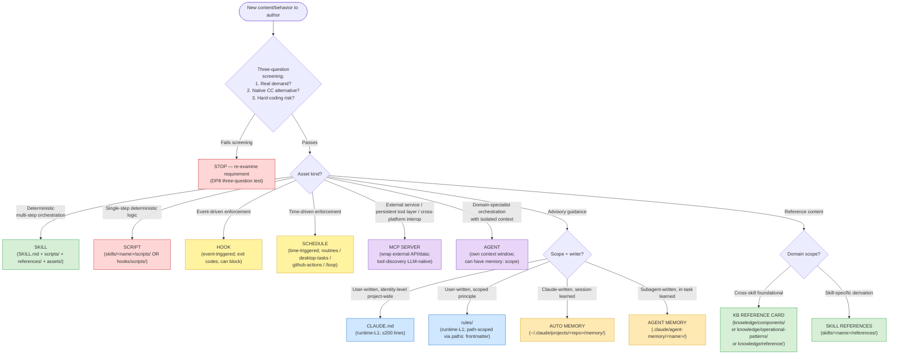
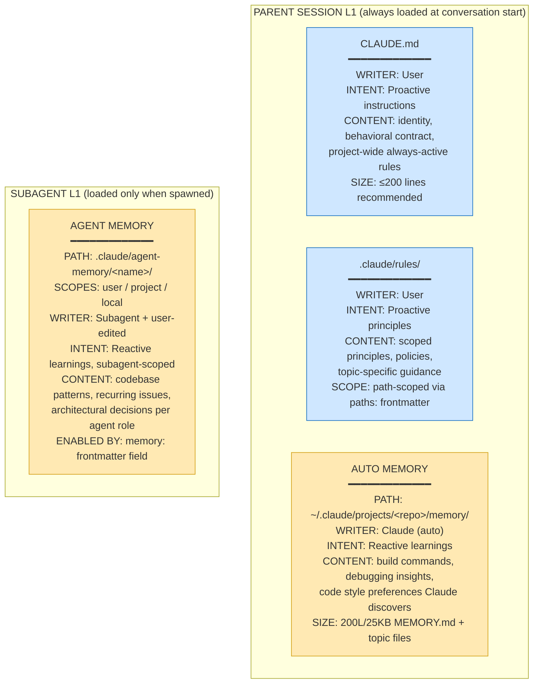

# Component Decision Framework

> **Scope**: Realization layer for [DP8 (Wrap & Extend)](../overview/design-principles.md#principle-8-dont-reinvent--wrap-and-extend). DP8 governs the *principle*; this card governs the *mechanics* — the decision tree + per-component scope tests + memory ecosystem treatment + worked examples that determine where each authored asset belongs.

> **Audience**: LLM-agent-actionable primary. Consumed by `scaffold-project` (DP8 Pre-Flight Check, Step 0), `audit-workspace` (Dimension 8 Compliance Scan), `integrate-existing` (CC overlay design), `architecture-advisor` agent (architectural review). Humans read for context.

> **How to use**: At authoring time, traverse the decision tree below to identify the canonical component type. Then consult the per-component scope test to verify fit. If no component fits cleanly, treat as authoring smell — re-examine the requirement (DP8 three-question screening test).

---

## Decision Tree

Color legend: 🔵 user-written proactive memory · 🟡 reactive memory · 🟢 deterministic / reference asset · 🟣 specialized orchestration · 🟠 event-driven · 🔴 stop or pure script.

---

## Component Type Matrix

| Component | Layer | Writer | Enforcement | Always-loaded? | Scope |
|---|---|---|---|---|---|
| `CLAUDE.md` | L1 (persistent memory) | User | Advisory | Yes; full file | Project / user / managed |
| `rules/*.md` | L1 (persistent memory) | User | Advisory | Yes (path-scoped via `paths:` frontmatter) | Project / user / managed |
| Auto memory | L1 (persistent memory) | Claude (auto) | Advisory | First 200L / 25KB of `MEMORY.md`; topic files on-demand | Per-repo (worktree-shared) |
| Agent memory | L1 for subagent (when spawned) | Subagent + user-edited | Advisory | First 200L / 25KB of subagent's `MEMORY.md` | user / project / local scopes |
| Skill | L2 metadata always; full content on invoke | User | Behavior on invoke | Metadata only | Plugin / user / project |
| Agent | L2 metadata always; full system prompt on spawn | User | Own context boundary | Metadata only | Plugin / user / project / managed |
| Command | (legacy; superseded by skills 2026) | User | Explicit slash invocation | Metadata only | Plugin / user / project |
| Hook | Event-driven external | User | Deterministic (exit codes) | Not loaded; fires on CC events | Project / managed |
| Schedule | Time-driven external | User | Deterministic (cron / interval) | Not loaded; fires on schedule | 4 sub-options: routines (cloud), desktop-tasks (local), github-actions (CI), `/loop` (in-session, 7-day expiry, `CronCreate`/`CronList`/`CronDelete` tools) |
| MCP server | Tool schema deferred-load | External / wrap | Tool-call boundary | Schema deferred; tools available when active | Project / user / managed |
| Script | Invoked by skill / hook | User | Deterministic | Not loaded; invoked | `skills/<name>/scripts/` or `hooks/scripts/` |
| KB reference card | On-demand (grep / read) | User | Advisory | Not auto-loaded | `knowledge/**/*.md` |
| Skill references | Part of skill pack | User | Composed into skill | Loads when skill is invoked | `skills/<name>/references/` |

---

## The 4-Component Memory Ecosystem

Per CC docs (memory + sub-agents), the complete persistent-memory layer comprises **four** components, all loaded as runtime-L1 in their respective scope, all advisory (not enforced):

**Key distinction** — proactive vs reactive (NOT layer-1 vs layer-2):

- **Proactive** (user-written): CLAUDE.md, rules — instructions/principles you author intentionally
- **Reactive** (Claude/subagent-written): auto memory, agent memory — learnings the system accumulates

ALL four ARE layer-1 always-loaded in their respective scope. Distinction is who writes, not when loaded.

**Recommended default for new agent memory**: `project` scope (shareable via version control). `user` for cross-project knowledge; `local` for gitignored personal notes.

---

## Per-Component Scope Tests (the load-bearing decisions)

### When to use SKILL vs RULE (most-common confusion)

| Use SKILL when... | Use RULE when... |
|---|---|
| Multi-step deterministic workflow | Single-axiom advisory principle |
| Domain-specialized procedure | Project-wide generalized policy |
| Verification block is meaningful (machine-runnable contract) | Always-active behavioral guidance |
| Loads on-demand only when triggered | Must be loaded at all times |
| Has scripts/, references/, or assets/ | Plain markdown only |
| Reusable across domains within project | Path-scopable via `paths:` frontmatter |

### When to use AUTO MEMORY vs CLAUDE.md / RULE

| Use AUTO MEMORY when... | Use CLAUDE.md / RULE when... |
|---|---|
| Claude discovers the pattern reactively | You're authoring the instruction proactively |
| Build commands / debugging insights / code style preferences | Identity, behavioral contract, project-wide policy |
| Content might evolve session-to-session | Content should be stable + version-controlled |
| Per-repo machine-local persistence is OK | Team-shared via git |

### When to use AGENT MEMORY vs SKILL REFERENCES

| Use AGENT MEMORY when... | Use SKILL REFERENCES when... |
|---|---|
| Subagent accumulates learnings across runs | Static knowledge tailored to skill execution |
| Knowledge evolves with each task | Knowledge is curated upfront |
| Agent persona is the natural owner | Skill is the natural owner |
| `memory: project/user/local` frontmatter active | Skill loads `references/` when invoked |

### When to use HOOK vs SKILL

| Use HOOK when... | Use SKILL when... |
|---|---|
| Event-driven (PreToolUse, PostToolUse, etc.) | Triggered by user intent / model auto-invocation |
| Deterministic enforcement (exit code 2 = block) | Workflow guidance / orchestration |
| Security gates (use `type: command` per LL-14) | Domain-specialized procedure |
| Plugin-distributed automation | Plugin-distributed capability |

### When to use HOOK vs SCHEDULE (event-driven vs time-driven)

| Use HOOK when... | Use SCHEDULE when... |
|---|---|
| Trigger is a CC event (PreToolUse, PostToolUse, SubagentStart, Notification, etc.) | Trigger is time/cron-based (every N minutes, daily at HH:MM, etc.) |
| Behavior should fire IN response to model action | Behavior should fire INDEPENDENT of model action |
| Pre-tool gates, post-tool validation, lifecycle automation | Polling, recurring maintenance, scheduled state-mgmt operations, periodic audits |

**4 schedule sub-options** — pick by where execution should happen:

| Sub-option | Runs on | Best for |
|---|---|---|
| Routines | Anthropic cloud (machine doesn't need to be on) | Background automation that survives restarts; minimum 1hr interval |
| Desktop scheduled tasks | Local machine via desktop app | Schedules needing local file/tool access; minimum 1min |
| GitHub Actions | CI pipeline | Repo-event-tied automation + cron schedules alongside workflow config |
| `/loop` (in-session) | Current CLI session | Quick polling; session-scoped; 7-day expiry; uses `CronCreate`/`CronList`/`CronDelete` tools |

---

## Worked Examples

### Example 1: Authoring "always re-fetch CC docs before editing KB content"

- Q1 screening: real demand (LL-10 recurrence) ✓; native CC alt? No ✓; rigidity risk? Low — it's a discipline statement ✓
- Q2 asset kind: ADVISORY guidance (not deterministic prescription)
- Q3 scope+writer: User-written, project-wide policy → **rules/**
- Result: bullet in `.claude/rules/kb-conventions.md` (load-bearing for all KB authoring)
- ✗ NOT a skill (it's not a multi-step workflow); ✗ NOT auto memory (not Claude-discovered); ✗ NOT a hook (no programmatic enforcement gate yet)

### Example 2: Authoring "scaffold a new CC plugin with placeholder structure"

- Q1 screening: real demand ✓; CC native? `claude plugin install` exists but doesn't scaffold from scratch ✓; rigidity? deterministic structure makes sense ✓
- Q2 asset kind: DETERMINISTIC multi-step orchestration with template assets
- Result: **SKILL** (`skills/scaffold-project/`) with `assets/templates/` + `scripts/` for filesystem operations
- ✗ NOT a rule (it's procedural, not advisory); ✗ NOT a script alone (multi-step + needs templates)

### Example 3: Authoring "code-reviewer that scans diffs and surfaces issues"

- Q1 screening: real demand ✓; CC native code-reviewer subagent exists as built-in option ✓; rigidity? customization needed ✓
- Q2 asset kind: domain-specialist orchestration with isolated context need (review reasoning shouldn't pollute main session)
- Result: **AGENT** (`agents/code-reviewer.md`) with `memory: project` enabled (accumulate codebase patterns + recurring issues across runs)
- ✗ NOT a skill alone (review benefits from isolated context); ✗ NOT just a rule (needs active reasoning)

### Example 4: Cross-platform agentic-OS interop (HydroCast calling RAS-exec / GTA tools)

Scenario: HydroCast wants to securely invoke tools from RAS-exec + GTA (separate agentic-OS platforms) from within a HydroCast CC session.

**Decision walkthrough**:
- Q1 screening: real demand (active project plan) ✓; CC native? — Plugin / API / MCP candidates ✓; rigidity? need flexible cross-platform composition ✓
- Q2 candidate comparison (NOT mutually exclusive — these can co-exist; question is fit-for-scenario):

| Approach | Fit FOR THIS scenario | Why this scenario; what each is best for |
|---|---|---|
| **CC Plugin** | △ Wrong primitive | Plugins are intra-project distribution (skills/agents bundled for ONE CC project's consumers). **Best when**: distributing CAB-derived components within one CC project. **Co-exists with**: MCP servers a plugin can wrap. |
| **Traditional API** (REST / GraphQL) | △ Suboptimal for agent consumers | Requires HTTP server + auth wrappers + manual marshalling + language-specific clients; tool-discovery is manual; NOT LLM-native. **Best when**: serving non-agent consumers (browsers, traditional services, language-locked clients). **Co-exists with**: MCP servers (an API + MCP can both surface the same backend; choose layer per consumer profile). |
| **MCP server** | ✓ Canonical for agentic-OS↔agentic-OS interop | LLM-native: tool schemas auto-discovered; designed for agent consumption; standardized JSON-RPC; transports: stdio/http/sse/ws; first-class CC integration. **Best when**: cross-platform agentic-OS tool exchange (this scenario). **Co-exists with**: API (for non-agent consumers) and Plugin (for intra-project distribution). |

**Result for this specific scenario**: **MCP servers** wrapping each agentic OS platform's toolset. RAS-exec exposes its tools as one MCP server; GTA exposes its tools as another. HydroCast's CC session connects to those servers (via `.mcp.json` or runtime). Tool calls become seamless from the agent's perspective. Bidirectional composition possible: each agentic OS can BOTH host MCP servers (exposing tools) AND consume MCP servers (using others' tools).

**Co-existence in practice**: a mature agentic-OS-platform may simultaneously expose:
- An **MCP server** for agentic-OS-to-agentic-OS tool exchange (canonical for this use case)
- A **REST API** for non-agent service consumers (web frontends, language-locked clients)
- A **CC Plugin** for distributing CAB-derived components within its own CC sessions

These layers are complementary, not competing. The decision is which layer fits which consumer profile, not which one to "pick".

**Security**: per-server auth tokens via `userConfig` with `sensitive: true` (stored in system keychain); env-var or OAuth based.

**Authoring smell to avoid in this scenario**: writing a Python "bridge adapter package" as the PRIMARY interop primitive that wraps agentic OS platforms as Python modules. Reasons: (a) loses LLM-native tool-discovery — bridge needs separate doc maintenance; (b) language-locks the agentic consumer (Python only); (c) doesn't compose with CC's tool-permission system; (d) reinvents what MCP standardizes. Bridge is fine as INTERNAL implementation of an MCP server (the MCP server is the user-facing primitive; the bridge is implementation detail).

For full strategic guidance on cross-platform interop (MCP vs API vs Plugin tradeoffs at scale, multi-platform agentic OS patterns), see future card `knowledge/operational-patterns/cross-platform-interop.md` (Wave 9+ target).

---

## Anti-Patterns

| Anti-pattern | Why it fails | Correct alternative |
|---|---|---|
| Domain-specialized prescriptive workflow as a RULE | Always-loaded; pollutes context budget; advisory framing inconsistent with prescriptive intent | SKILL (load on invoke; can prescribe) |
| Single-step Bash one-liner wrapped as a SKILL | Adds skill registry overhead for trivial logic; SKILL.md + scripts/ structure is over-built | SCRIPT in `hooks/scripts/` invoked from rule or `Bash(*)` permission |
| Reactive learning manually written into CLAUDE.md | Manual maintenance burden; auto memory handles this natively | Let auto memory accumulate; promote to CLAUDE.md only if it crosses sessions reliably |
| Domain-specialist subagent without `memory:` field | Loses cross-run learning accumulation; agent re-derives same patterns each invocation | Add `memory: project` (recommended default) |
| Security gate as `type: prompt` hook | Self-policing; not independent verification (LL-14) | `type: command` hook with deterministic script (exit 2 = block) |
| Visual reference / decision framework as standalone overview KB card | overview/ is principle-layer; technical realization belongs downstream (per KB layering convention memory) | Components/ card OR skill references/ asset (this card is itself a worked example) |
| Visualization authored standalone (no backend-derived data source) | Backend/artifact-first architecture: viz is RENDERING, not authoring; standalone vizes drift from canonical data + duplicate truth | Derive viz from canonical structured data (JSON / YAML / KG query); the viz tool consumes data, not the other way around. Hand-authored exception: human-facing communication (slides, casual diagrams) — but agent-consumed viz must be backend-derived. See memory `project_backend_first_architecture_philosophy.md`. |
| Cross-platform agentic-OS tool sharing via custom Python bridge / wrapper package | Reinvents MCP's standardization; loses LLM-native tool-discovery; language-locks consumers | MCP server wrap (the canonical primitive for agentic-OS interop); bridge OK as MCP server's internal implementation only |
| New skill scaffolded without `scripts/` + `references/` + `assets/` placeholder dirs | Forces re-fetch of skill-creator structure later when extending; CAB convention is default-include even when empty | Default-include all 3 placeholder directories at scaffold time (per `feedback_skill_default_placeholder_bundled_resources` memory) |

---

## Cross-References

This card is the canonical realization layer consumed by:

- `skills/scaffold-project/SKILL.md` Step 0 (DP8 Pre-Flight Check) — applies the decision tree at scaffolding time
- `skills/audit-workspace/SKILL.md` Dimension 8 (DP8 Compliance Scan) — uses the matrix + anti-patterns to score existing assets
- `skills/integrate-existing/SKILL.md` — applies the framework when overlaying CC architecture on a non-CAB codebase
- `agents/architecture-advisor.md` — references this for architectural review decisions
- 5-axis audit framework's `skill_pack_home` axis (Wave 8 Phase 2B'/2C/2D' audits) — refined to "recommended_cc_component" determination per this matrix

## See Also

- [Design Principles](../overview/design-principles.md) — DP8 principle layer (this card is the realization)
- [Architecture Philosophy](../overview/architecture-philosophy.md) — runtime layers + memory architecture
- [Agent Skills](agent-skills.md) — skill-specific mechanics
- [Subagents](subagents.md) — agent-specific mechanics including `memory:` field
- [Memory & CLAUDE.md](memory-claudemd.md) — CLAUDE.md + auto memory mechanics
- [Hooks](hooks.md) — hook event catalog + types
- [MCP Integration](mcp-integration.md) — MCP server mechanics
- Schedule feature (CC docs): [scheduled-tasks](https://code.claude.com/docs/en/scheduled-tasks) + [run-claude-on-a-schedule](https://code.claude.com/docs/en/common-workflows#run-claude-on-a-schedule)
- Skill bundled resources canonical reference: `~/.claude/plugins/marketplaces/claude-plugins-official/plugins/skill-creator/skills/skill-creator/SKILL.md` § "Anatomy of a Skill"
- `notes/lessons-learned.md` LL-30 — DP8 enforcement gap (origin lesson)
- Future cards (Wave 9+ targets surfaced by this card): `knowledge/operational-patterns/cross-platform-interop.md` (MCP-as-canonical-interop strategic guide), `knowledge/operational-patterns/rag-scaling-decision-framework.md` (RAG scaling at 100+ KB files threshold)
