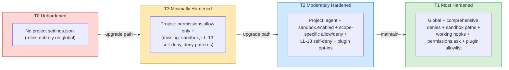

# Cross-Project Settings Hardening

> **Scope**: Operational pattern for managing CC `settings.json` across the full layered surface — global (`~/.claude/settings.json`), project (`<project>/.claude/settings.json` and `.local.json`), and plugin scopes. Covers layering, default-deny on Claude edits, drift detection, and settings-hardening tier escalation.

> **Audience**: LLM-agent-actionable primary. Consumed by `audit-workspace` (Dimension 8 + new settings-hardening dimension), `scaffold-project` (project-init settings), `integrate-existing` (CC overlay on existing codebase), `update-config` skill (the override path for Claude-driven settings edits). Humans read for cross-project consistency reasoning.

> **How to use**: Consult before any settings.json authoring or audit. The default-deny rule below is load-bearing for ALL Claude-orchestrated work; treat as inviolate unless explicit override path active.

---

## Layering Pattern (the cross-project canonical)

CC settings layer top-down with deny-wins-over-allow + project-overrides-global semantics. CAB's advisory canonical: **global owns shared infrastructure; project owns scope-specific identity and overrides; never overlay redundantly**.

```mermaid
flowchart TB
    subgraph global[" GLOBAL ~/.claude/settings.json (canonical baseline)"]
        g1["Bash security gate hook (PreToolUse)<br/>+ canonical script ~/.claude/scripts/bash-security-gate.sh"]
        g2["Sandbox: ssh/aws/gnupg denyRead/denyWrite"]
        g3["Permission deny: destructive ops (rm -rf, sudo, force-push, eval, ...)"]
        g4["effortLevel = subscription-tier default (xhigh for Max+Opus 4.7)"]
        g5["enabledPlugins comprehensive list"]
        g6["permissions.ask: Edit/Write(**/.claude/settings*)<br/>(structural backstop on Claude settings edits)"]
    end
    subgraph project[" PROJECT .claude/settings.json (scope-specific)"]
        p1["agent: <project-orchestrator-name>"]
        p2["enabledPlugins: project-specific additions (e.g., cab@cab: true)"]
        p3["sandbox: {enabled: true} (inherits global denyRead/denyWrite)"]
        p4["permissions.allow: project-specific Bash patterns + tools"]
        p5["permissions.deny: scope-specific destructive ops"]
        p6["permissions.deny: Edit/Write(.claude/settings*)<br/>(LL-13 self-modification protection)"]
        pno["DO NOT add: redundant security gate hook<br/>(global covers it; copy creates drift surface)"]
        pno2["DO NOT add: effortLevel override<br/>(UXL-039: omit so global xhigh inherits)"]
        pno3["DO NOT add: stub hooks<br/>(security theatre worse than no hook)"]
    end
    global -.inherits.-> project
    style g1 fill:#cfe7ff,stroke:#1971c2
    style g6 fill:#ffd6d6,stroke:#c62828
    style p6 fill:#ffd6d6,stroke:#c62828
    style pno fill:#ffe9b3,stroke:#d4a017
    style pno2 fill:#ffe9b3,stroke:#d4a017
    style pno3 fill:#ffe9b3,stroke:#d4a017
```

### Inheritance matrix (the canonical reference)

| Concern | Global owns | Project owns | Avoid |
|---|---|---|---|
| Bash security gate | Hook + canonical script | Nothing (rely on global) | Project-level copy of script (drift surface) |
| Post-tool formatter | Project-language-specific (e.g., `ruff format` for Python) | Project may add language-specific formatter | — |
| Sensitive paths (ssh/aws/gnupg) | denyRead/denyWrite + sandbox | `sandbox: {enabled: true}` to inherit | Re-declaring deny patterns |
| Destructive ops deny | rm -rf, sudo, force-push, eval | Scope-specific deny if needed | Conflicting allow rules |
| `effortLevel` | Subscription-tier default (xhigh) | OMIT (UXL-039) | Project downgrade to `high` without explicit cost-throttle rationale |
| `permissions.allow` Bash | Cross-project patterns | Project-specific patterns | Duplicate-with-different-glob entries |
| Self-modification deny | NOT applicable (per-project per LL-13) | `Edit/Write(.claude/settings*)` in deny | Editing global to add |
| `agent` (default) | (default) | Project-specific orchestrator (e.g., `orchestrator`, `ras-orchestrator`) | — |
| `enabledPlugins` | Comprehensive list | Project-specific additions | Re-listing all plugins (lose global inheritance) |
| Settings-edit approval gate | `permissions.ask` for `Edit/Write(**/.claude/settings*)` | (covered by global ask + project deny) | Bypassing via direct Claude edits |

---

## Default-Deny on Settings Edits (load-bearing rule)

**Rule**: Claude does NOT directly Edit/Write any CC settings.json file by default. This applies across all `**/.claude/settings*.json` paths (global, project, project-local).

**Default behavior:**

1. PRODUCE a surgical diff (specific lines + rationale) of proposed change
2. SURFACE the diff to user with explicit approval ask
3. WAIT for per-file approval before invoking Edit/Write
4. Treat batch directives like "/cab:execute-task ... proceed to execute" as one-time approval for the SPECIFIC batch surfaced — does NOT carry over to future settings edits

**Override paths** (when default-deny is suspended):

- `update-config` skill explicit invocation (purpose-built for settings edits)
- User direct command: "go ahead and edit X" / "apply directly" / equivalent
- Hook-driven automation operating in its own approval scope (e.g., `fewer-permission-prompts` skill)

**Structural enforcement (defense-in-depth):**

| Layer | Mechanism | Where |
|---|---|---|
| 1. Behavioral discipline | Memory `feedback_settings_json_default_deny_edit.md` | Orchestrator / general-purpose agents |
| 2. Rule layer | `.claude/rules/security.md` 6th bullet | Auto-loaded every session |
| 3. CC permission system | `permissions.ask: ["Edit(**/.claude/settings*)", "Write(**/.claude/settings*)"]` | Global settings.json |
| 4. Per-project deny | `permissions.deny: ["Edit(.claude/settings*)", "Write(.claude/settings*)"]` | Each project's settings.json (LL-13) |

**Anti-pattern this prevents**: silent settings drift through Claude's auto-edits during multi-step task flows; permission inversions; cross-project config divergence accelerated by orchestrator-driven cleanup.

**Why default-deny vs ask**: deny is too strict (breaks `update-config` skill flow); ask is the harness-level prompt that lets explicit approval through while blocking silent edits. The combination of behavioral discipline + ask + per-project deny gives 4-layer enforcement.

---

## Settings-Hardening Tiers

**Audit applicability**: `audit-workspace` Dimension 8 (or new dimension) scores each project's settings.json against this tier; promotes findings for cross-project alignment work.

**T2 = recommended baseline** for any CC-integrated project. T3 = onboarding-stage acceptable but flagged for promotion. T0 = inherits global only; acceptable for ephemeral / experimental projects.

---

## Anti-Patterns

| Anti-pattern | Why it fails | Correct alternative |
|---|---|---|
| Project-level Bash security gate hook duplicating global | Drift surface — project script can age out of sync with global; redundant fire on each tool call | Rely on global hook (canonical); project hook ONLY if project-specific gate semantics needed |
| Stub PreToolUse hook (e.g., `echo 'Pre-tool check passed'`) | Security theatre — has hook shape but zero gating semantics; worse than no hook (operators may believe it's protective) | Either real hook OR no hook (global covers it) |
| Broken hook reference (script path doesn't exist) | Silent failure — hook errors may not surface; confidence in security posture is false | Verify script existence; remove broken reference; rely on global if no project-specific needed |
| `effortLevel` project-level override that DOWNGRADES from global | Without explicit cost-throttle rationale, downgrades user's subscription-tier default unnecessarily (UXL-039) | OMIT project-level; let global xhigh inherit. Override only with documented rationale. |
| `allowedTools` object form at any layer | Deprecated/legacy; not in current CC settings schema; silent no-op | Remove; use `permissions.allow/ask/deny` arrays |
| Claude-driven settings.json edits without explicit approval | Silent drift; permission inversions; cross-project divergence accelerated | Default-deny rule (this card § Default-Deny) |
| Conflicting allow + deny rules for same pattern | Deny wins; allow is dead config; confusing audit surface | Conflict scan during audit; remove redundant allow |
| Project re-declares all global deny patterns | Maintenance burden; drift surface; doesn't add security | Inherit global; project deny adds ONLY scope-specific destructive ops |
| `enabledPlugins` re-listing global plugins to "ensure" enablement | Loses global inheritance pattern; re-listing creates drift surface | Project enabledPlugins = ADDITIONS only (e.g., `cab@cab: true` for CAB-consuming projects) |

---

## Cross-Project Drift — Concrete Findings (Session 41 audit, 2026-04-30)

Audit of 5 settings files revealed drift severity beyond initial assessment:

| Finding | Files affected | Severity | Resolution |
|---|---|---|---|
| Global `allowedTools` deprecated block | Global only | HIGH | Removed Session 41 |
| RAS-exec stub PreToolUse hook (`echo 'Pre-tool check passed'`) | RAS-exec only | HIGH | Pending manual-apply diff (`notes/settings-hardening-pending-2026-04-30.md`) |
| Cross-project security gate script drift | HydroCast (1619 bytes) vs Global (6062 bytes) | MED | Wave 9+ alignment task; canonical = global; flag in this card |
| `effortLevel: high` downgrade-from-xhigh | HydroCast + RAS-exec | MED | Pending manual-apply diffs |
| Sandbox absent | HydroCast (had it), GTA (added Session 41), CAB (added Session 41) | MED | Resolved Session 41 (CAB+GTA); HydroCast already had |
| LL-13 self-modification deny absent | CAB (added Session 41), GTA (added Session 41) | MED | Resolved Session 41 |
| `enabledPlugins` not specified in HydroCast/GTA | (acceptable; inherits global) | LOW | No action; pattern documented |
| GTA bare-bones (5 allow rules only) | GTA | LOW (pre-Session-41; now T2 post-Session-41) | Resolved Session 41 |

**Drift severity insight**: HydroCast and RAS-exec are *consumers* of CAB plugin but had non-canonical settings shapes. CAB-as-advisor under-deployed before Session 41. This card is the canonical reference; `audit-workspace` extension is the Wave 9+ propagation lever.

---

## CAB's Advisor Role (cross-project propagation)

CAB's advisory function spans BOTH global config + project config. The advisor must:

1. **Document the canonical pattern** (this card)
2. **Audit-detect drift** (`audit-workspace` Dimension 8 + new settings-hardening dimension)
3. **Surface drift to user** with concrete diff + escalation path (this card's "Cross-Project Drift" section pattern)
4. **Propagate via `integrate-existing`** when CAB overlays on a new codebase (uses this card as scaffolding template)
5. **Self-audit** — CAB's own settings.json must exemplify the canonical pattern (Session 41 brought CAB to T2 from T3)

**Anti-pattern (cross-project)**: CAB advises pattern X but CAB's own config violates X. Propagation credibility breaks.

---

## Forward State (Wave 9+ Revisit Gate)

This card is **provisional / experimental** (confidence: B). Designed to be revisited at Wave 9+ for:

- **Optimize**: tighten the layering matrix as drift evidence accumulates; promote to higher-confidence rule
- **Enhance**: add more anti-patterns + drift-detection mechanisms; integrate into `audit-workspace` Dimension 8 scoring
- **Delete**: if the operational pattern proves not load-bearing OR if a better-shaped artifact subsumes it (e.g., a canonical `settings-hardening` skill that consumes this card as `references/`)

**Wave 9+ revisit triggers**:
- HydroCast / RAS-exec / GTA cross-project alignment work surfaces patterns this card doesn't anticipate
- New CC settings schema features (e.g., revised permission model) require updates to layering matrix
- `audit-workspace` integration produces enough drift findings to warrant promotion to formal rule

**Pre-Wave-9 deferred items (not in this card; future cards):**
- `knowledge/operational-patterns/cross-platform-interop.md` — MCP-as-canonical-interop strategic guide (different scope)
- Cross-project security gate script alignment (HydroCast 1619B vs global 6062B) — Wave 9+ alignment task

---

## See Also

- [Component Decision Framework](../components/component-decision-framework.md) — DP8 realization layer; this card applies the framework to settings.json domain
- [Design Principles](../overview/design-principles.md) — DP8 (Wrap & Extend) + DP6 (Multi-Agent Autonomy) principle layers
- `.claude/rules/security.md` — Default-deny on settings edits rule (6th bullet); LL-13 self-modification semantics
- `.claude/rules/kb-conventions.md` — KB authoring conventions including temporal-neutrality rule
- `update-config` skill (CC-bundled) — explicit override path for Claude-driven settings edits
- `audit-workspace` skill — Dimension 8 (DP8 Compliance Scan); future settings-hardening dimension consumes this card
- `scaffold-project` skill — uses this card as scaffolding template for new project settings
- `integrate-existing` skill (Wave 9+ — not yet implemented; forward-stated consumer) — would use this card during CC overlay on existing codebases
- `notes/settings-hardening-pending-2026-04-30.md` — pending manual-apply diffs (HydroCast + RAS-exec) from Session 41 audit
- Memory `feedback_settings_json_default_deny_edit.md` — load-bearing default-deny rule (LL-31 candidate)
- `notes/lessons-learned.md` LL-13 (self-modification semantics), LL-14 (command-hook vs prompt-hook). LL-30 (DP8 enforcement gap) and LL-31 (default-deny on settings edits) are PROMOTION CANDIDATES — referenced across new Session 41 artifacts but not yet codified as formal LL entries; promotion pending next lessons-learned review pass.
