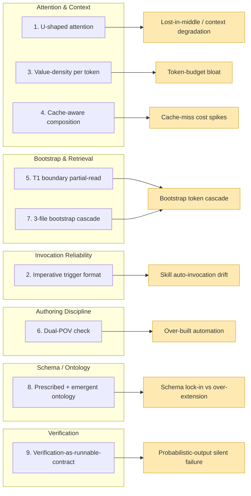

# LLM Interaction Patterns

> **Scope**: Observable patterns governing how to author content that LLM agents reliably process, invoke, retrieve, and verify. Not a comprehensive context-engineering primer (see `context-engineering.md` for that); not a bootstrap protocol spec (see `bootstrap-read-pattern.md`). This card synthesizes the LLM-interaction tactical layer that cross-cuts those operational surfaces.

> **How to use**: Consult when authoring KB cards, skill descriptions, agent definitions, rule files, or any content LLMs subsequently retrieve/invoke. The pattern → failure-mode map below is the quick reference; per-pattern detail provides rationale + authoring implications + provenance.

> **Provenance citations**: Inline `LL-NN` and `UXL-NNN` markers throughout this card cite the *origin lesson* the pattern traces to. Per `.claude/rules/kb-conventions.md` temporal-neutrality rule, provenance citations are ACCEPTABLE; CAB-development-stage narrative ("Wave 8 introduced...") is NOT.

---

## Pattern → Failure-Mode Map



---

## Pattern 1: U-Shaped Attention

**Mechanic**: Transformer attention is not uniform across the input window; it concentrates on the *beginning* and *end*, with degraded recall mid-context ("lost-in-middle"). High-priority content placed mid-context gets de-prioritized in agent reasoning.

**Authoring implications**:
- Place load-bearing content at start (prominence) and end (recency) of context-loaded files
- Bury reference material mid-file
- For CLAUDE.md / rules: lead with identity + behavioral contract; tail with anti-patterns

**Provenance**: research literature (lost-in-middle studies); operationally validated in CAB across LL-29 (passive-doc insufficient invariant).

**Cross-refs**: `design-principles.md` DP1 (Context Engineering); `context-engineering.md` for compaction mechanics.

---

## Pattern 2: Imperative Trigger Format

**Mechanic**: Skill descriptions compete for auto-invocation when multiple skills match an intent. The model selects based on description text but registry attention degrades mid-session. Three-axiom imperative descriptions (when X / DO NOT Y / use Z) are denser, more scannable, and shape decisions better than narrative prose.

**Authoring template**:

```
INVOKE THIS SKILL when [trigger condition]. DO NOT [competing-skill behavior] -- use this skill's [specific capability] instead.
```

**Why three axioms**: when (positive trigger) + prohibition (negative-space disambiguation) + alternative (redirects model attention). Each axiom is a decision-shape, not a sentence-shape.

**Authoring implications**:
- Description first sentence MUST be imperative + trigger-condition specific
- Prohibition clause MUST name the competing skill that wrongly auto-invokes
- Alternative clause MUST specify the in-skill capability that supersedes
- Combined `description` + `when_to_use` budget is 1,536 chars per `component-standards.md` — front-load the trigger axiom

**Provenance**: GTA project boots-on-the-ground observation, captured in `notes/end-vision-cab-2026-04-28.md` § Q4 Pattern Capture #1.

**Cross-refs**: `.claude/rules/component-standards.md` (frontmatter + char budget).

---

## Pattern 3: Value-Density per Token

**Mechanic**: Every token of context is a shared, finite resource. Tokens that don't aid the LLM's next request actively displace productive output. The inverse of "more context is better" — it's "context that earns its slot is better".

**Authoring implications**:
- KB cards: 300-line cap (`kb-conventions.md`); reference cards may exceed when content is genuinely cohesive
- CLAUDE.md: 200-line discipline; prefer @imports over inlined content
- Skill SKILL.md: load-on-invocation, so length is acceptable; metadata footprint is what's always-loaded
- Auto memory: 200 lines / 25 KB hard cap; entries earn slots structurally

**Failure mode**: token-budget bloat — bootstrap cost rises until productive headroom shrinks. CAB historical: pre-fix ~41K bootstrap (~17% of 200K) → post-fix ~7K (~3%) via bootstrap-efficiency restoration.

**Provenance**: CC docs (200-line discipline); LL-29 (passive-doc insufficient — structural weaving > passive accumulation).

**Cross-refs**: `context-engineering.md` § "200-Line Discipline"; `bootstrap-read-pattern.md` § "Budget Ceiling".

---

## Pattern 4: Cache-Aware Composition

**Mechanic**: CC's prompt cache delivers ~200x cost savings on cache hits (cached tokens ~$0.003/1M vs ~$0.60/1M uncached at 200K window). Cache hits require stable prefix content across turns; any edit to system-prompt-region content busts cache for all subsequent turns. Anthropic prompt cache TTL is 5 min — sleep windows >5 min cost a cache miss on wake.

**Authoring implications**:
- CLAUDE.md is system-prompt-region — edits mid-session bust cache for the rest of the session
- Add/remove MCP servers mid-session shifts cache boundary
- Skill metadata in registry is cache-stable when skills are not added/removed
- Front-load stable content; dynamic content arrives later in conversation
- Background-task wake delays: pick <270s (stays in cache) or commit to >1200s (one cache miss buys a longer wait); avoid 300-600s no-mans-land

**Provenance**: official CC pricing docs; LL-10 fresh-fetch precedent (cache + freshness interaction).

**Cross-refs**: `context-engineering.md` § "Prompt Cache Optimization" — canonical home for the mechanics. This card flags the *authoring discipline* implication.

---

## Pattern 5: T1 Boundary Partial-Read

**Mechanic**: State files (`progress.md`, `TODO.md`) grow unbounded over time, but bootstrap cost stays constant if reads are bounded by an HTML-comment marker (`<!-- T1:BOUNDARY -->`). Top section above the marker is the "current state" tier; tail below is historical narrative loaded on-demand only.

**Why it works**:
- HTML comments are invisible in rendered markdown but greppable by tooling
- Authors maintain placement; measurement (`hooks/scripts/bootstrap-cost.sh`) catches drift
- Decouples *file size* (durable, semantically preserved) from *bootstrap read size* (bounded, cheap)

**Generalizable shape**: hard inner gate (CAB: 100-line `current-task.md` hook) + soft outer convention + measurement-driven drift detection.

**Provenance**: CAB LL-25 (state tracked-by-default), LL-26 (tense hygiene), Session 32 Pivot 1 (LL exclusion from bootstrap).

**Cross-refs**: `bootstrap-read-pattern.md` is canonical home for the boundary marker convention + L2/L3 partial-read mechanics.

---

## Pattern 6: Dual-POV Check (Top-Down + Bottom-Up)

**Mechanic**: Before building automation (hooks, scripts, custom commands), apply two analytical lenses in sequence:

1. **Top-down**: what behavior do I want the LLM to exhibit? Does CC have a native mechanism that achieves it?
2. **Bottom-up**: what's the failure mode I'm preventing? Is the proposed automation actually the cleanest counter, or am I building over a bigger problem?

Skipping either lens — or running them out of order — produces over-built automation that creates worse UX than the native mechanism it duplicates. (Top-down first surfaces native solutions cheaply; bottom-up first risks anchoring on the proposed build before checking native alternatives.)

**Authoring implications**:
- Pre-build: explicitly state both POVs; if either is unclear, defer the build
- Component scaffolding: `scaffold-project` Step 0 (DP8 Pre-Flight Check) is the top-down arm enforced
- Workspace audit: `audit-workspace` Dimension 8 (DP8 Compliance Scan) is the after-the-fact detection

**Failure mode prevented**: over-built automation. Examples: custom hook duplicating a native CC permission rule; scripted skill wrapping a one-liner Bash; agent persona re-implementing a skill.

**Provenance**: orchestrator memory `feedback_dual_pov_check.md` (codified after multiple Wave 6-7 recurrences); LL-30 (DP8 enforcement gap).

**Cross-refs**: `design-principles.md` DP8 (Wrap & Extend); `skills/scaffold-project/SKILL.md` Step 0; `skills/audit-workspace/SKILL.md` Dimension 8.

---

## Pattern 7: 3-File Bootstrap Cascade

**Mechanic**: Cold-start sessions read state files in cheap-to-expensive cascade — `current-task.md` (full, ≤100 lines), `progress.md` (partial, T1 only), `TODO.md` (partial, T1 only). Each layer gates the next; if L1's pointer answers the question, skip L2/L3.

**Generalizable shape**:
- Hard gate on innermost file (CAB: `enforce-current-task-budget.sh` blocks commits >100 lines)
- Soft gates on outer files (T1 boundary convention + measurement)
- Reader-determined cadence — `lessons-learned.md` is on-demand at phase transitions, NOT always-loaded
- Escalation paths documented (full read when partial-read window doesn't cover the decision)

**Cross-refs**: `bootstrap-read-pattern.md` is canonical home for CAB's specific cascade.

**Provenance**: CAB Sessions 28-32 bootstrap-efficiency restoration (LL-29); 41K → 7K bootstrap cost reduction.

---

## Pattern 8: Prescribed + Emergent Ontology

**Mechanic**: Schemas can be both prescribed (fixed type taxonomy) AND emergent (escape hatch for novel types). Pure-prescribed schemas lock in early; pure-emergent schemas lose semantic invariants. Hybrid: prescribed core types + `kind: "other"` with `subtype:` string for novel cases. Authoring discipline: surface emergent types periodically; promote recurring patterns to first-class types in the next schema revision.

**Authoring implications**:
- KG node taxonomies (Wave 8 Phase 2F target): prescribed core types + `kind: "other"` escape hatch + audit-driven promotion
- Frontmatter `tags:` arrays: free-form (emergent); periodic audit promotes high-frequency tags to documented vocabulary
- Skill registry: SKILL.md frontmatter is prescribed by CC; CAB conventions are emergent and rule-codified over time
- Audit verdict types (5-axis framework): 6 prescribed verdicts (KEEP / MERGE / REPACK / REWRITE / DELETE / GAP) + supplementary axes can extend without breaking core (e.g., `freshness_note` added Session 40)

**Failure mode prevented**: schema lock-in (forces premature taxonomy commits) OR over-extension (every novel case becomes a new type, taxonomy explodes).

**Provenance**: Graphiti research paper (bi-temporal validity + prescribed + emergent ontology pattern); pattern absorbed at v2 plan §4 Phase 2F per `notes/end-vision-cab-2026-04-28.md` § "Graphiti Decision".

**Cross-refs**: `notes/end-vision-cab-2026-04-28.md`; v2 plan §4 Phase 2F (KG schema design).

---

## Pattern 9: Verification-as-Runnable-Contract

**Mechanic**: Component definitions (skills, agents, plans, phase gates) include verification blocks that are *machine-executable*, not prose-described. A future autonomous agent (or a verifier subagent today) can literally `subprocess.run()` the verification block and check exit codes — verification becomes structurally queryable, not narrative-disclosed.

**Authoring template**:

```markdown
## Verification

### Automated
- [ ] `pytest tests/test_<feature>.py` passes
- [ ] `ruff check . --select F` exits 0
- [ ] `git status` shows expected file set

### Manual
- [ ] [Specific manual check the verifier agent should perform]
```

**Authoring implications**:
- Every skill SKILL.md SHOULD have a Verification section
- Every plan phase gate MUST have explicit acceptance criteria, not "verify it works"
- Agent definitions SHOULD specify their own verification method (recursive: how does the agent verify the agent?)
- Audit methodology layer: stop-the-line conditions, anti-sycophancy floors, and confidence tagging are all instances of this pattern at the audit layer (per v2 plan §11 AI-Integrated Addendum)

**Failure mode prevented**: probabilistic-output silent failure. LLM outputs are probabilistic; without runnable verification, errors compound silently.

**Provenance**: CAB DP7 (Verification as Architectural Requirement); `notes/end-vision-cab-2026-04-28.md` § Q4 Pattern Capture #3; v2 plan §11 (AI-Integrated Addendum).

**Cross-refs**: `design-principles.md` DP7; `agents/verifier.md`.

---

## Provenance Summary

| # | Pattern | Origin | Trace |
|---|---|---|---|
| 1 | U-shaped attention | Lost-in-middle research | LL-29 |
| 2 | Imperative trigger format | GTA + end-vision §Q4 | end-vision §Q4 #1 |
| 3 | Value-density per token | CC docs + LL-29 | LL-29 |
| 4 | Cache-aware composition | CC pricing + LL-10 | LL-10 |
| 5 | T1 boundary partial-read | LL-25/26 + Session 32 Pivot 1 | LL-25, LL-26 |
| 6 | Dual-POV check | Wave 6-7 recurrences | LL-30 + memory `feedback_dual_pov_check` |
| 7 | 3-file bootstrap cascade | Sessions 28-32 efficiency restoration | LL-29 |
| 8 | Prescribed + emergent ontology | Graphiti paper | v2 plan §4 Phase 2F + end-vision § Graphiti Decision |
| 9 | Verification-as-runnable-contract | DP7 + end-vision §Q4 | end-vision §Q4 #3 |

---

## See Also

- `knowledge/operational-patterns/state-management/bootstrap-read-pattern.md` — canonical cascade + T1 boundary mechanics
- `knowledge/operational-patterns/state-management/context-engineering.md` — canonical 200-line + cache + compaction mechanics
- `knowledge/overview/design-principles.md` — DP1 (Context Engineering) + DP7 (Verification) + DP8 (Wrap & Extend)
- `.claude/rules/kb-conventions.md` — KB authoring constraints (incl. temporal-neutrality rule)
- `.claude/rules/component-standards.md` — frontmatter validity + char budget + provenance citations OK
- `notes/end-vision-cab-2026-04-28.md` — § Q4 Pattern Capture origin for #2 + #9
